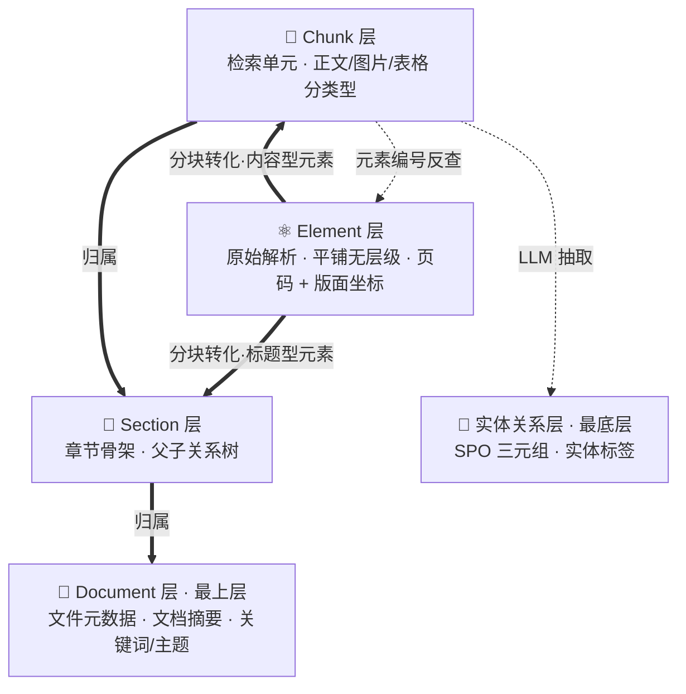

# 百万文档下Agentic知识库如何做到「先准后快」

## 前言

本文将深入探讨高级知识系统的构建方法，重点涉及**RAG系统的高级应用方式、知识结构与推理机制的融合，以及大模型工具调用能力在知识系统中的落地方式**。为了更顺畅地理解文中内容，建议读者具备以下基础：

- **知识图谱与结构化知识表示**
理解实体（Entity）、关系（Relation）、属性（Attribute）、三元组（Triple）等基本概念；具备一定的图数据库或图谱构建经验更佳。
- **NLP基础**
熟悉 GPT/BERT 类模型的工作机制，了解 Embedding 表征、向量相似度计算、上下文窗口等核心概念。
- **RAG（Retrieval-Augmented Generation）原理与实战经验**
能够掌握 RAG 的基本流程：查询构造 → 文档检索 → 上下文拼接 → 文本生成；
同时了解一些进阶优化方法，如 chunking 策略、hybrid 检索、负样本设计、prompt 封装等。
- **模型工具调用能力（Tool Use & Function Calling）**
理解如何让大模型调用外部函数/工具；理解 tool schema 的构建、输入输出格式化、模型响应指令的触发机制。

*关于当前热议的传统RAG无用论，我的观点是取其精华，去其糟粕，需要看到其对大量文档的筛选能力，也要清楚召回精度有限的局限性。关于工程上的实现细节，不在本文讨论范围*

*另需说明：全文采用**方法论视角**——讨论「一套 Agentic 知识库该怎么建、每个设计背后的取舍是什么」，而不聚焦于某个具体系统的落地代码。选型示例（如 MySQL / Milvus / MinerU / BGE-M3 等）只作为读者理解的参照物，并非必需的技术栈。*

参考知识系统后端代码：[https://github.com/caixiongjiang/agentic_knowledge_system](https://github.com/caixiongjiang/agentic_knowledge_system)

## 体系化的知识结构

论文：**PIKE-RAG: sPecIalized KnowledgE and Rationale Augmented Generation**

论文链接：[https://arxiv.org/pdf/2501.11551](https://arxiv.org/pdf/2501.11551)

PIKE-RAG划分了不同级别知识系统需要具备的能力范围，也对知识层级和知识体系有很好的归纳。下文中部分思想来源于该文章，建议大家可以有时间可以认真研读一下。

知识系统的静态骨架，本质上是在回答三个基础问题：**数据以什么粒度分层？以什么方式存储？以什么思路被读取？** 这一章就围绕这三个问题依次展开——**多层知识结构**决定粒度、**知识存储**决定物理承载、**像人类一样阅读文档**决定读取思路。这三层互为前提：分层是存储的依据，存储是读取的物理基础，读取思路又反过来定义了分层与存储该保留哪些字段。它们共同构成后续所有能力（抽取、检索、Agent 反馈、溯源）的地基——地基没打好，上层的所有努力都是「垃圾上做精装修」。

### 多层知识结构

传统 RAG 之所以在复杂问题上频频失灵，一个根本原因是它**只在一个粒度上工作**：把文档切成片段，全部塞进同一个向量库，再用同一个 query 去扫。这种做法隐含一个假设——所有问题都适合在片段粒度回答。但现实中问题粒度是天然分层的：

- 「这份文档讲的是什么」是**文档级**问题；
- 「第三章提出的注意力机制」是**章节级**问题；
- 「某个超参数的具体取值」是**段落级**问题；
- 「X 与 Y 之间的因果关系」是**实体关系级**问题。

强行用片段粒度去回答宏观问题，召回的要么是片段化的零碎信息，要么是大量不相关的噪声；反过来，用片段粒度回答实体关系问题，又会丢失图结构带来的推理路径。所以构建一套合格的知识系统，首先应该放弃「单粒度全量召回」的幻想，转而构建一套**多层知识结构**，让不同粒度的信息各居其位，检索时按问题入口选择合适的层级切入。

我的做法是将其分为五层，结构上自上而下是 **Document → Section → Chunk → Element → 实体关系层**：Document 是最上层（一份完整文档），Section 和 Chunk 是中间两层（章节骨架与检索单元，分块后形成、存在层级关系），Element 是原始解析结果（平铺、无层级），实体关系层是最底层（从 Chunk 抽取而来的语义网络）。其中 Section 层和 Chunk 层都是由 Element 层转化而来——Element 是解析底座，分块之后按「结构骨架」和「检索单元」两个维度重组出 Section 和 Chunk。整体结构如下图：

图中粗实线（`==>`）是**分块转化 / 归属**关系：Element 经分块转化为 Chunk 和 Section，Chunk 归属到 Section、Section 归属到 Document；虚线（`-.->`）是**抽取 / 反查**关系：Chunk 经 LLM 抽取出实体关系层，Chunk 通过所记录的元素标识反查回 Element。下面分层展开。

**Element 层**是解析阶段的原子产物，对应文档里每一个被识别出的版面单元——一段正文、一张图、一个表格、一条公式。它应当保留每个元素所在的**页码**和**版面坐标**（即元素在页面上的位置框，通常做归一化处理），作为后续所有上层结构的「地理坐标」。这一层不直接参与检索，但承担两个职责：一是给片段提供精确到页和位置的溯源；二是当片段信息不足时，作为更细的回查单元。之所以要单独保留 Element 层、而不是直接从片段起步，本质上是因为片段是聚合产物——聚合一旦发生，元素的版面坐标就被抹平，而「点一下引用直接跳到原文第 N 页第 X 区域」这种溯源能力，恰恰只能建立在坐标之上。把 Element 作为不可再分的底座保留下来，既是所有「精确溯源」能力的物理前提，也是 Section 层和 Chunk 层得以构建的原材料。

**Chunk 层**由 Element 层转化而来——具体来说，是把 Element 层里的「内容型元素」（正文 / 图片 / 表格 / 公式）按语义边界聚合或切分而成的检索单元。一个片段通常由一个或多个连续的元素聚合而成，并保留它由哪些元素聚合而来的记录，以便反查到 Element 层；反过来，从 Element 层也能反查出某个元素落在哪个片段里。片段应当分类型存储：正文 / 图片 / 表格，各自有不同的内容结构（表格要存表标题、表体、表注；图片要存图标题、图注、所在章节标题、页码）。至于类型为何要分流、而不是一并压成同质文本，理由在于表格的「行列结构」和图片的「标题 + 位置」在召回展示环节本身就承载着信息量——用户想看的是「某行某列的值」「这张图的含义」，而不是「一坨连在一起的文字」。一旦压平，这些结构信号连同 rerank 阶段的行列对齐依据都会消失；分流存储的意义，恰恰是让异构元素被召回后依然能被正确还原、正确渲染。片段是大多数召回的落脚点，也是检索的最小单元。

**Section 层**同样由 Element 层转化而来，但走的是另一条路径——从 Element 层里的「标题型元素」（被解析器标记为标题的元素）出发，组织成文档的章节骨架。解析器给出的标题层级标记通常不可靠——PDF 标题层级识别历来是难题，解析器经常把正文加粗当成标题，或者把二级标题识别成一级。所以不应该直接信任这个标记，而应该从标题编号（`1.1.2` 这种）反推真实的父子关系，记录为「父章节是谁」，运行时由这些父子关系拼装成完整的章节树。每个叶子章节还要维护一份「它下面挂着哪些片段」的清单——这是后续「下钻定位」能力的物理基础。这里执意用编号反推、不信任解析器的层级标记，源于对两类信号可靠性的排序：标题编号是作者亲手写下的语义标注，属于「一等信号」；而解析器基于版面特征做的层级判断，属于「二等信号」——解析器把标题识错是常态，作者把编号写错反而是罕见。把一等信号作为真相来源、二等信号只作为参考，是降噪的正确姿势。至于 Section 和 Chunk 都源自 Element、却仍然要分成两层，是因为它们回答的是两类不同的问题：Section 回答「结构在哪里」，Chunk 回答「内容是什么」——一个是骨架，一个是血肉，只有分开存储，两者才能各自按自己的读写模式做优化。

**Document 层**位于粒度的最顶端，对应一份完整的入库文档。它不直接持有 Element，而是通过 Section 树间接组织起整份文档的内容——Section 是它的章节子树，Chunk 是子树上的叶子。这一层应当承载文件级元数据（文件名、内容哈希、存储路径、页数、语言）、文档级摘要（中英文摘要）以及关键词/主题标签。之所以要单独立一个 Document 层、而不是让 Section 直接挂在「文件」这个抽象概念上，是因为「文件」本身需要一份稳定的元数据载体——文件被改名、被移动、被重新解析时，Section 和 Chunk 完全可能重建，但 Document 的 ID（通常由内容哈希或 UUID 决定）必须保持稳定，才能担得起「整棵知识树的根」这个角色。这一层对检索的价值同样不可替代：有一类问题天然属于文档级——「这份文档讲什么」「这份文档和那份文档的主题差异」「这份文档的核心贡献」——只有从文档摘要入手才能一击即中，从片段或章节切入反而会陷入片段化的琐碎细节里。

**实体关系层**位于整套结构的最底层，对应知识图谱的 SPO 三元组和实体标签，应当用专门的向量库存语义向量，再用图数据库存图结构。它和前面四层不同——前四层是文档自身的结构分层（Element 是原始解析的平铺结果，Section/Chunk/Document 是分块后形成的层级结构），实体关系层则是从 Chunk 里**额外抽取**出来的语义网络，是经 LLM 二次加工后的产物，因此位于结构图的最底层，而不是挂在文档结构之内。这一层存在的意义，是补齐片段检索天然覆盖不到的那类问题——「X 和 Y 是什么关系」「Z 依赖于哪些因素」「A 是 B 的子类吗」——这类问题要的是关系遍历和图推理，不是语义相似度；只有把实体与关系显式抽出来落到图里，这类问题才有精确回答的可能。这一层也是整套体系里最复杂的一环——抽取质量、图规模、遍历延迟都需要权衡，建议作为系统的演进方向分阶段引入，而不是一开始就追求完整。

层与层之间的关联不应该是松散的指针，而应该用**显式的关系记录 + 双向反查**共同织成一张网：每一段片段都要明确记录「它属于哪个章节、属于哪份文档」，这样才能从一段内容瞬间跳回它所在的上层语境；每个章节都要记录「它的父章节是谁、子章节有哪些」，这样才能拼出完整的目录树；每一份问答对、每一份摘要，都要记录「它是从哪段片段、哪个章节抽出来的」，这样才能从抽象产物回溯到原文出处。任何一层的命中都可以沿着这张网上下穿行——既能从一段内容向上回溯到所在章节和整篇文档，也能从一个章节向下钻取到它包含的所有片段，还能在同章节内左右扩展看上下文。

形成这套体系的核心理由可以浓缩成一句话：**让知识在它本该出现的粒度上被检索到**。这不是炫技，而是对「问题粒度天然分层」这一事实的妥协——只有当存储结构本身是分层的，检索才有可能做到分层。

### 知识存储

上一节讨论的是**概念层**的 5 个分层，这一节要谈的是**物理层**——它们各自应该落在什么数据库里。这里必须先破除一个直觉：**逻辑分层与物理分库并非一一对应**。同一个概念层里的不同侧面往往有完全不同的读写模式——比如「片段」这个概念，它的元信息是结构化的、需要 JOIN，正文是变长大文本，向量是高维稠密数值，每一个侧面都该放到最适合它的库里。粗略对应关系如下：

| 概念层 | 主要承载库 | 存放内容 |
|---|---|---|
| Document 层 | 关系型 + 文档 + 向量 | 元数据（关系型）+ 摘要正文（文档）+ 摘要向量（向量） |
| Section 层 | 关系型 + 文档 + 向量 | 父子关系、下挂片段清单（关系型）+ 标题文本 / 摘要（文档）+ 标题向量 / 摘要向量（向量） |
| Chunk 层 | 关系型 + 文档 + 向量 | 归属关系（关系型）+ 正文 / 类型专属字段（文档）+ 原文向量 / 增强向量（向量） |
| Element 层 | 关系型 + 文档 + 对象 | 元素属性（关系型）+ 原始内容（文档）+ 二进制 blob（对象） |
| 实体关系层 | 图 + 向量 | 节点边与图结构（图）+ 实体 / 关系语义向量（向量） |

理解了这张映射，下面的分库理由就顺理成章——**按数据形态分库、而不是按概念层分库，才能让每一种读写模式都用最适合自己的引擎**。

很多团队在做知识库时会陷入一个误区：选一个「主力数据库」（通常是某个向量库或 Elasticsearch），然后把所有东西都往里塞——元数据、原文、向量、关系全混在一起。这种做法在原型阶段很快，但一旦文档规模上去、检索粒度变多，问题就会集中爆发：向量库做不了关系 JOIN，关系库做不了 ANN，全文库做不了图遍历，对象存储又做不了结构化查询。每多塞一种数据，就多一份性能瓶颈和扩容耦合。

**正确的做法是按数据形态分库，各司其职**：

**关系型数据库**（如 MySQL）存所有「热元数据和层级关系」——文件索引、各层的元信息（元素/章节/片段各自的属性）、记录层级归属的关系数据（哪段片段属于哪个章节和哪份文档、哪个章节的父章节是谁）、以及摘要和问答对回指到原文的关联记录。这些数据体积小、需要 JOIN、需要事务保证，是关系型数据库的主场。批量写入时应当按百条量级合并，避免高频小写入拖垮 IO。

**文档数据库**（如 MongoDB）存所有「大文本和结构化内容」——片段的正文和类型专属的元信息（表格片段存表标题/表体/表注，图片片段存图标题/图注/所在章节，文本片段存纯文本）、章节的标题文本、问答对列表、摘要正文、元素的原始内容。这些数据形态不固定（表格片段和文本片段的元信息结构完全不同），体积大，按文档组织天然契合文档数据库的模型。这里之所以不选关系型数据库来放正文，是因为正文本身就是「变长 + 半结构化」的产物——关系型数据库的行式存储在这种字段上无论查询还是更新都拘束，而文档数据库的 schema-less 模型和大文本读取性能都更贴合场景。

**向量库**（如 Milvus）存所有「向量」——包括稠密向量（多语言 embedding，图索引 + 余弦相似度）和稀疏向量（学习型稀疏编码，倒排索引 + 内积度量）。应当按粒度拆成多个独立的向量库：原文片段向量、语境增强片段向量、章节标题向量、章节摘要向量、文档摘要向量、问答对向量、实体向量、关系标签向量，一路一个库。粒度必须拆分、不能混存的根本原因是「数据分布差异」：片段向量动辄几百万条、文档摘要向量只有几千条，硬塞进同一个库里，图索引的建图参数根本没法同时兼顾——两侧数据量差好几个数量级，一套参数永远只能偏袒其中一边；召回数量的差异也会让过滤表达式越写越复杂。分库之后，每个库都能按照自己数据的密度、频率、召回规模单独调参，才谈得上「各自最优」。

**对象存储**（如 MinIO/S3）存所有「二进制 blob」——原始上传文件、解析阶段从 PDF 里抽出的图片。这里有一个关键的工程模式叫 **Claim Check（凭证检查）**：消息流里**永远不传大对象**，只传文件标识和存储路径，需要时再去对象存储取。这条铁律不是洁癖，而是被血泪教训反复验证过的——一旦让图片 base64 进消息流，单条消息体动辄几 MB 甚至几十 MB，下游消费者反序列化时轻则内存告急、重则直接 OOM，消息队列的吞吐也会被同步拖垮。Claim Check 的价值就在于把「大对象引用」与「大对象本体」拆开：消息流保持轻量、只传票据，取货动作留给对象存储。这已经是处理二进制数据的行业标配。

**图数据库**（如 Neo4j）存图谱的节点和边。图结构必须交给图数据库、而不是在向量库里将就，理由很简单：多跳推理、最短路径、子图查询——这些关系遍历动作是图数据库的看家本领，换成向量库来做，等价于用 K 跳近邻搜索硬凑，复杂度和延迟都会失控。合理的分工是让实体和关系的语义向量承担「关系型问题的语义入口」职责，一旦落到真正的关系推理，就必须切到图数据库里执行。

这种分库带来的代价是**写入链路变复杂**——任何一个处理组件产出结果后，要按数据形态分发到不同的写入通道，由对应的写入组件批量落库。

至此，物理底座就位——五类库各司其职、共同承载概念分层的所有侧面。**底座一旦按数据形态分好，上层的抽取链路只负责按数据形态把结果分发到对应通道、检索层只负责按问题粒度到对应库里取数**——两侧都能各自按最优模式独立演进，这才是分库设计的真正价值。

### 像人类一样阅读文档

如果说前两节讨论的是知识系统的**静态骨架**——数据怎么分层、怎么落库；那么这一节要谈的是**动态读取**——同一份文档进到系统后，Agent 应当以什么思路去读它。这个动作看似小，实则决定了整套系统在"单文档问答"这个高频场景下能否做得又准又快。

在 Agent 时代下，很多工程化难题都需要参考人类思维方式来解决——阅读信息这件事尤其如此。让模型学人类的阅读套路，能一次性绕开很多工程上难缠的召回问题。

人类拿到一份陌生文档时的阅读动作是有套路的：先翻目录，定位到相关章节，再读那一节的正文，遇到引用再回头看上下文，最后合上书能说出整体讲了什么。没有人会一上来就把全书 500 页全部记住再去回答问题。但传统 RAG 干的就是这件事——把所有片段向量化，问题来了之后在全局向量空间里捞 top-K，相当于逼着模型「在没看过目录的情况下，从全书每一页里猜哪几页可能相关」。

[VectifyAI/PageIndex](https://github.com/VectifyAI/PageIndex) 提出了一个很朴素的反思路：**单文档问答不需要全局向量检索，先把文档的层级结构抽出来当「地图」，让模型先看地图再窄范围取文**。这个思路和多层知识结构天然契合——章节树就是目录，每个章节记录的下挂片段列表就是每节的具体内容索引，页码和版面坐标就是定位坐标。

在单文档问答场景下，应该显式把这套工作流写进 system prompt 的行为指引里。当问题被限定在单个文档内时，Agent 的工具调用优先级应当是：

1. **翻目录** —— 先拉文档目录树，建立全局认知；
2. **查术语** —— 如果问题里有精确术语/数值，做字面穷举定位；
3. **下钻定位** —— 从命中的章节下钻到它下面的具体片段；
4. **读正文 / 看前后文** —— preview 不够时读全文，或看前后邻居片段；
5. **回溯上层** —— 需要回到上层语境时溯源到章节 / 整篇文档。

只有当问题本身是跨文档的开放性问题时，才回退到全局语义检索做向量召回。

用全局向量检索去回答单文档问题，属于典型的「杀鸡用牛刀」——一方面往 top-K 里塞进大量别的文档的片段，凭空引入无关噪声；另一方面把文档自身天生的结构信息一并抹掉。反过来看，结构化导航是确定性的、可解释的、零噪声的，延迟还更低。PageIndex 的价值不在于发明了什么新算法，而在于把「人类阅读常识」重新带回了 RAG——这件事在大家一窝蜂堆向量库的时候，恰恰是被遗忘的。

落到字段层面，支撑这套思路的是几个看似不起眼但至关重要的设计：每个章节记录的父章节标识让章节能拼成目录树；每个章节记录的下挂片段列表让下钻一步到位；每段内容保留的页码和原始元素编号让任何一次召回都能精确还原到原文位置；语境增强片段把章节标题注入到片段的向量化文本里，让片段脱离上层语境时也不至于语义漂移。这些字段共同构成了「像人类一样阅读」的物理基础——**没有这些字段，"像人类一样阅读"就只能停留在 prompt 工程层面，无法落到工具调用上**。

*额外的话题，为什么不直接采用这种思路来做整个知识库而只将其作为单个文档阅读的利器？*

*原因也很简单，知识库内部的不同文档没有办法像一个单个文档一样形成一个有逻辑，有关联关系以及有顺序的整体。这些能力依旧需要传统RAG的手段来补齐。*

## 知识抽取链路

前一章把静态骨架讲清楚了：数据以什么粒度分层、以什么形态存储、以什么思路被读取。这一章讨论的是**动态构建**——一份文档从进入系统到成为可检索的知识资产，中间要经历一条完整的抽取链路：**解析层**把异构原文压成统一中间表示；**分块层**把中间表示重组成检索单元；**LLM 额外抽取**把隐式信息（摘要、问答对、实体关系）显式化；**语义构建**把所有可检索对象向量化。四段递进，每一段的产出都直接决定下游能力的上限——**上游丢一点信息，下游就多一层无法弥补的缺口**。

### 解析层

文档解析是整个知识系统的入口，也是最容易低估成本的一环。一份 PDF 里可能同时包含正文、表格、图片、公式、多栏排版、跨页表格、嵌套标题——如果解析阶段就把这些信息压扁成纯文本，后面所有的分块、抽取、检索都是在「垃圾上做精装修」。所以解析层的核心目标只有一个：**输出一个保留版面结构的统一中间表示，让下游不需要关心原文是什么格式**。

统一中间结构建议是一份「解析结果」加一串「元素信息」：一份文档被解析成一串元素，每个元素带类型标记（正文 / 图片 / 表格 / 公式 / 丢弃）、所在页码、版面坐标（即元素在页面上的位置框，通常归一化到固定范围）和类型专属的内容字段。所有下游组件——分块、摘要、向量化——都只认这个结构，不认原始格式。这里坚持要架一层 IR，是照搬编译器领域的经典思路——**把 N 种输入格式归一成 1 种中间表示，让下游只写 1 套逻辑而不是 N 套**。反例很好想象：如果下游组件直接对接原始格式，每加一种新格式都要把分块、摘要、向量化统统改一遍，工作量从 N+M 膨胀成 N×M，还会让不同格式的对齐问题在每个下游组件里反复出现。

在具体实现上，PDF 推荐走 [MinerU](https://github.com/opendatalab/MinerU)——这是目前工业级 PDF 解析里对版面结构识别最完整的开源方案之一，能区分标题层级、识别表格结构、抽图片、保留公式 LaTeX。MinerU 输出后应当做一层清洗：保留正文/图片/表格/公式四类，过滤空正文，图片上传对象存储并在元素记录里只存路径。对于 JSON/CSV 这类结构化文件，则可以内置直接构造，不走重型解析器。

特殊元素的保留策略是这一层的关键决策：

- **表格**：保留表体 + 表标题 + 表注，存解析器给出的结构化形态，不立即拍平成纯文本。拍平的代价往往被低估——行列结构在召回展示时天然是有价值的信号，用户想看的是「某行某列的值」，一旦压成「一坨连在一起的文字」，rerank 阶段连行列对齐的判断依据都失去了。
- **图片**：base64 解码后传对象存储，元素里只留路径 + 图标题 + 图注 + 版面坐标。二进制 blob 之所以既不能进消息流、也不能进文档库，理由前后一致：进消息流会撑爆消息体（对应 Claim Check 模式），进文档库会拖慢查询和索引。图片的本质是「按需取用」——不应该常驻热路径。
- **公式**：存 LaTeX 源码和格式标记，分块时作为 LaTeX 文本并入正文一起处理，不做文本清洗。这里刻意跳过清洗，是因为常规清洗规则（去多余空格、统一标点）是为自然语言设计的，用在 LaTeX 上就是破坏语法；保留原样，反而能最大程度守住公式的信息完整性。
- **标题层级**：解析器给出的标题层级字段不可靠，所以这一层只标记「这是个标题」，真正的层级关系留到 Section 摘要阶段从标题编号反推。刻意不「一次到位」，是因为解析阶段的标题识别误差本身就大，强行在这一步定层级会把错误固化进整棵结构树；把这一步推迟到摘要阶段用编号反推，遵循的正是「先用可靠信号定结构、再让结构反哺解析」这条稳健路径。

这里有一个工程细节值得展开：**解析 → 分块的消息传递应当是自包含的**。解析完成的消息里直接带上所有解析出的元素，下游分块组件消费时**不回读数据库**，直接从消息重建解析结果。这样安排的目的是规避一种隐蔽的竞态——如果分块组件转身去读元数据库，很可能读到「元素元信息还没写完」的中间状态，进而漏处理一部分元素。让消息自包含，等价于把「解析完成」和「可被下游消费」压成同一个原子事件；代价是消息体积会大一些，但配合 Claim Check 模式（大对象只放对象存储，消息里只带标识）已经把体积问题绕开了。

### 分块层

分块是 RAG 里被讨论得最多、也最容易陷入「调参玄学」的环节。社区里流传着大量「片段长度 / 重叠长度」的「最佳实践」，但大多数都隐含一个假设：**分块是个无脑的文本切分问题**。这个假设是错的。

推荐的分块设计哲学是八个字：**结构优先，长度兜底**（Structure-First, Size-Constraint）。默认算法的工作方式是：先按段落空行切，遇到超长段落再依次按换行符、句号、逗号、空格递归细分，只有当结构边界撑不住时才用长度硬切。配置上目标长度 1000 字符、重叠 200 字符，但结构优先模式下重叠实际很少触发，因为结构边界已经天然把语义单元隔开了。

固定长度这条路之所以走不通，症结在于它会**粗暴切断语义单元**——一句话被劈成两半、一张表格被拦腰斩断、一个列表项和它的解释被分进两个片段。这种切割一到召回阶段就会立刻反噬精度：前半句命中的片段后半句不在，模型拿到的上下文是残缺的；表格被截成两半后，表头和表体一旦分离，下半张表就变成一堆无法解读的孤立数字。相比之下，结构感知分块能守住语义边界，让每个片段至少是一个完整的「可独立理解单元」。固定长度的「最佳实践」之所以流传甚广，是因为它简单可复现——但简单不等于正确，在严肃的知识系统里，结构感知应当是默认选项、而不是可选项。

异构元素的分块策略应当是分流处理的，不是一刀切：

- **文本**：用缓冲区累积连续的短文本元素，攒够再一次性写出，避免一个元素一个片段造成片段爆炸。写出时用字符偏移精确记录每个片段包含哪些原始元素的编号，这是后续溯源到元素级的物理基础。缓冲机制的必要性来自现实文档的分段习惯——很多文档的段落非常短（一句话一段），若「一段一片段」，片段数量会爆炸到无法管理，同时每个片段自身的上下文又都不足；缓冲的作用正是把相邻的短段落聚合成一个上下文完整的片段，做「数量」和「质量」的平衡。
- **表格**：≤4000 字符的整表作为一个片段，保留完整行列结构；超过 4000 字符则按行切，**表头在每个切分块里重复出现**。表头必须重复的理由是「可解读性优先」——任何一块被单独召回时都应当能被人和模型读懂；如果表头只留在第一块里，第二块一旦独立命中，就只是一堆孤立数字。用少量 token 冗余换取可解读性，这笔账划算。
- **图片**：一个图片元素对应一个图片片段，向量化文本由图标题 + 图注 + 所在章节标题拼接而成。索引阶段之所以不调 VLM，主要出于两点权衡：一是 VLM 描述在这个阶段是冗余的——图标题通常已经够用作向量化输入；二是 VLM 的成本极不可控，对全库图片批量跑一次几乎等同于烧光预算。VLM 更合理的位置是对话阶段按需触发（用户问「这张图讲什么」时再调），而不是索引期一把梭。
- **公式**：并入正文缓冲区，和正文一起切分。LaTeX 源码本身就是文本，不需要特殊处理。

代码块是一个容易被忽略的缺口：技术文档里代码块的语义完整性至关重要（一个函数被切成两半就废了），但很多分块实现会把代码块当普通文本处理。**正确做法是**：识别到代码块后整体作为一个片段，超长时按语义边界（函数/类边界）切，而不是按字符长度切。对于技术文档类知识库这是必须补的缺口。

语言检测在分块阶段应当是三级递进的：文档级（解析阶段对前若干字符做 Unicode 脚本统计给出初值）→ 片段级（分块阶段对每个片段的向量化文本重新检测，覆盖文档级初值）→ 章节级（章节摘要时再检一次）。之所以要做成三级、而不是一步到位，是因为混排文档在真实业务里普遍存在——一份技术报告完全可能正文是中文、代码注释是英文、引用是日文；用单级检测给整份文档扣一个语言标签，很容易做出错误判断，进而影响向量化模型选型和摘要策略。三级递进的意义在于让每个粒度都用最贴合自己的语言判断，把错误局限在当层、不至于层层传染。

### LLM 额外抽取

如果只做片段向量化，知识库的天花板就是片段本身的语义完整性。但很多问题天然不属于片段粒度——「这份文档的核心贡献是什么」需要文档级抽象，「这一节的论证链条是什么」需要章节级抽象，「X 和 Y 是什么关系」需要实体级抽象。这些抽象不是片段拼一拼就能得到的，**必须让 LLM 在索引阶段做一次「主动理解」，把隐式信息显式化成可检索的结构化产物**。这是知识系统从"信息检索"升级到"知识检索"的关键一步。

LLM 抽取建议分成两条线：

**摘要链**：章节摘要 → 文档摘要。章节摘要是这条链的基础，工作方式应当是**自底向上逐级上卷**：先对每个叶子章节调 LLM 生成摘要，再把叶子摘要拼起来作为父章节的输入，逐级上卷到根节点。至于为何不选「全文一次性摘要」这条看似更省事的路，可以从三个维度拆开看：其一，LLM 输入长度天然受限，长文档全文丢进去要么被截断、要么直接超 token，截断丢信息、超 token 直接报错；其二，逐级上卷天然保留了结构信息——父节点摘要本质是「子节点摘要的摘要」，可解释、可下钻，用户问「第三章讲了什么」时可以直接返回第三章的摘要，而不用去全文摘要里硬找；其三，聚焦上下文里的摘要质量本就远高于泛化上下文，叶子摘要因为输入是紧扣主题的章节正文而不是混杂的全书，输出稳定得多。文档摘要在章节摘要完成后再做一次上卷，并额外抽取关键词和主题标签。

**QA / 实体链**：Atomic QA（问答对）和实体关系抽取（SPO 三元组）。Atomic QA 的思路是把片段主动改写成「问题-答案」对，让向量化目标是「问题」而不是「陈述」——这个改写之所以重要，是因为用户实际提问的行为是「问题对问题」的匹配，而不是「问题对陈述」的不对称匹配。传统 RAG 用陈述句向量去匹配问句，本身就存在天然的语义不对称——问句「注意力机制怎么工作的」和陈述句「注意力机制通过计算 Q K V 矩阵...」之间的向量相似度，往往低于两个问句彼此之间的相似度。把陈述改写成问题、让匹配双方形态对齐，正是修复 RAG 召回精度的一个隐性手段。实体关系抽取则抽出 SPO 三元组，为图路由和关系型问题预留入口。

这条链路的设计有一个重要的工程节奏：**先打通管道再填肉**。意思是先把所有组件的接口、消息格式、向量库写入接口、写入组件都定义好并对齐，让数据能从源头流到末端；再逐个替换组件内部的真实 LLM 调用。这套节奏之所以关键，是因为在大型系统里，链路层面的问题（消息格式不对、消息主题路由错、写入字段缺失）远比组件内部实现的问题更难定位——链路问题是分布式的、跨组件的，组件问题只是局部的。先把管道用模拟数据跑通，本质上是提前验证了架构；等到真正填肉时，任何异常都被压缩在单个组件内，定位成本是局部的而不是全局的。相反的顺序——先把每个组件实现好、再拼装成链路——一旦链路上出问题，就需要同时调试 N 个组件，排障成本是指数级的。

### 语义构建

向量化看似简单——调个 embedding 模型把文本变成向量嘛——但真正决定召回质量的，是「**给什么东西做向量化**」这个选择。同一个片段，向量化它的原文、向量化它的标题增强版、向量化它改写成的问答对，得到的召回表现会完全不同。

语义构建应当遵循一个原则：**让向量化目标尽可能贴近用户会怎么问**。具体到不同元素：

- **原文片段（原文路）**：直接用片段的原始文本（表格是去 HTML 的纯文本，图片是图标题拼接）。这是最基础的一路，也是必不可少的一路——并非所有问题都能被改写或增强，大量用户提问就是直接引用原文片段，原文向量承担的正是这类场景下的兜底匹配。
- **语境增强片段（增强路）**：章节标题 + 换行 + 片段原文。这一路的价值在于修补「片段脱离上层语境时的语义漂移」。举个直观例子：某个片段内容是「该方法通过引入多头机制缓解了这个问题」——单独向量化这个片段，模型根本不知道「该方法」指什么；把前置章节标题「3.2 Multi-Head Attention Mechanism」拼在前面，语义立刻锚定。它与原文路并行存在，好处是让 LLM 路由器可以按问题特征在两路之间选择。至于为何不直接把章节标题写回原文片段——因为原文片段承担着展示和溯源职责，必须保持纯净；增强路只用于召回、不参与展示，两者分离才能各干各的。
- **章节标题**：单独向量化章节标题。这条向量线单独存在，是为了支撑「按章节入口」的检索——当用户抛出「第三章讲什么」这类问题时，语义本就在匹配章节主题、而不是具体段落，从章节标题向量进入远比从片段进入精准。
- **章节 / 文档摘要**：向量化摘要正文，支撑宏观问题入口。摘要必须单独建向量，是因为宏观类问题（比如「这份文档的核心贡献是什么」）的语义与任何具体片段都不接近，只与整体摘要接近；没有摘要向量这一路，这类问题几乎不可能召回到合适的内容。
- **问答对**：应当只向量化问题部分，让匹配变成"问题对问题"；不要把答案也拼进去，否则向量会被答案的长文本稀释，反而劣化问题匹配。

embedding 模型的选择是「**一套稠密 + 一套稀疏**」：

- **稠密**：推荐用多语言 embedding 模型（如 `qwen3-embedding-0.6b`，1024 维）。选多语言而不是单语，是尊重知识库天然的混排属性——同一份文档里中文正文夹杂英文术语的场景比比皆是，单语模型遇到这种混合文本会明显劣化；多语言模型本就是为中英混排设计的，跨语言检索（例如「attention mechanism」命中「注意力机制」）也只有在多语言模型上才成立。
- **稀疏**：推荐用学习型稀疏编码（如 BGE-M3），输出稀疏向量。这里有一个反主流的选择——**稀疏检索不一定要用 Elasticsearch 做 BM25，可以把稀疏向量也塞进向量库**。这么做的核心动机是**运维收敛**：一个向量库同时管稠密 HNSW 和稀疏倒排，比同时维护向量库 + ES 两套检索栈简单一个量级；而且 BGE-M3 是学习型稀疏，效果已经接近甚至超过传统 BM25 这种统计式稀疏。代价当然存在——失去了 ES 那套成熟的倒排调参生态（同义词、停用词、自定义分析器），但对大多数知识库场景而言这笔账划得来：运维复杂度是长期成本，调参灵活度只是短期收益。

一个争议的设计是**不按中英文分库**。所有语言都进同一个向量库，语言只作为元数据字段。坚持不分库的理由有两条：其一，多语言 embedding 模型本身已经支持中英混合向量化，一旦分库反而把跨语言检索能力硬生生撕开——「attention mechanism」应当能命中「注意力机制」，可分库之后这两者落在不同库里，跨库检索还要额外做一层路由；其二，分库会给路由器叠一层「先判断 query 语言再选库」的耦合，而语言判断本身就有出错概率，错一次就整路召回全部落空。统一向量库的代价确实是单库数据量更大，但现代向量库的图索引在百万级规模下毫不吃力，这压根不是值得担心的瓶颈。

## 检索

### 检索的三路互补：稠密 / 稀疏 / 字面

检索方向上，社区里经常有「向量 vs BM25 谁更牛」的口水战，但实战中真正成熟的答案只有一个：**都要，且要三路互补**——稠密向量、稀疏向量、字面匹配。稠密向量擅长语义匹配——「怎么提高模型的注意力」能命中「attention mechanism enhancement」；稀疏检索擅长词面匹配——「BERT-4」这种精确术语，向量模型很可能把它和「BERT-3」「BERT-base」的向量拉得很近，反而召回一堆错的，稀疏检索看 token 完全一致就一剑封喉。两类问题的失败模式正好互补，所以 Hybrid 不是可选项，是必选项。

具体落地方式上，稀疏检索可以用学习型稀疏向量（如 BGE-M3）写入向量库的稀疏向量字段，用倒排索引建索引，用内积做度量。这是「学习型稀疏」而不是「统计型 BM25」——BGE-M3 是训练出来的稀疏编码器，效果接近甚至超过传统 BM25 的 IDF 统计。这个选择的核心动机前面讲过：**运维收敛**。代价是失去了 ES 那套成熟的倒排调参生态，但收益是少维护一整套检索栈。

稠密向量的实现比较常规：query 经多语言 embedding 编码后入向量库，按粒度分布到多个独立的向量库（原文片段库、语境增强片段库、章节标题库、章节摘要库、文档摘要库、问答对库），每个库独立建图索引，度量用余弦相似度。各库独立的原因前面讲过——不同粒度的向量密度和检索频率差异很大，混在一起会让建图参数难以同时优化。

除了稀疏 + 稠密这两路向量，还应当有一路**字面匹配**走文档库（如 MongoDB）：精确等值查询做整字段匹配，布尔组合查询做多条件组合。字面匹配和稀疏向量之间并非等价关系——稀疏向量固然能命中术语，但本质仍是「软匹配」，带相似度分数、带阈值；而字面匹配是「硬匹配」——只要提到了就一定命中，是确定性的。面对「找出所有提到 RoPE 的片段」这种穷举式需求，向量检索会因为相似度阈值漏掉一些边角命中，字面匹配则不会。这正是术语穷举工具赖以立足的物理基础。

### 分层检索

有了三路互补的基础方向，还只解决了「用什么手段查」的问题。检索真正的难点在另一个维度：**同一句问题落在不同粒度上，就该从完全不同的入口进入**。这一节要讲的正是这条思路——为什么必须分层、每一层对应什么问题、每一层应当以什么为入口。

传统 RAG 的路由是僵化的——代码里写死「向量召回 + BM25 召回 + Rerank」，无论用户问什么都统一走片段级检索。但现实里问题粒度差异极大：

- 问「这份文档讲什么」——应当从**文档摘要**入手；
- 问「第三章的方法是什么」——应当从**章节标题 / 章节摘要**入手；
- 问「某个超参数的具体取值」——应当从**片段**入手；
- 问「找出所有提到 RoPE 的段落」——应当从**字面匹配**入手；
- 问「A 和 B 之间是什么关系」——应当从**实体关系图**入手。

把宏观问题硬塞给片段入口，召回的要么是片段化的零碎信息、要么完全不命中；反过来，用文档摘要回答"某个参数值"这种细节问题，摘要根本不保留这种细节，同样不命中。**任何一个入口在自己的粒度之外都会失效**——这就是分层检索非做不可的根本原因。

而"先判断问题落在哪个粒度、走哪些入口"这个决策动作本身，在传统 RAG 里要么靠规则、要么被直接跳过。在 Agentic 系统里，这一步必须交给 LLM 来做——**意图判断本就是 LLM 的主场**，规则引擎顶多能识别「"如何"开头走语义路」这种粗粒度模式，处理不了「这个 query 其实是想对比两个方法」这类需要真语义理解的判断。而它的成本只是一次百毫秒级的推理调用，换来整套召回策略的精准化，性价比极高。

至于「LLM 判断入口 → 各路并发召回 → 融合排序 → Agent 拿到结果后自主反馈修订」这套思路具体怎么落地成一个可并发、可组合、可自我迭代的检索系统——那是下一章「Agentic 检索系统」要展开的能力实现层。

## Agentic 检索系统

上一章的分层检索给出了**思路**：不同粒度的问题走不同粒度的入口。这一章要讨论的是**能力**——把这条思路真正落到工程里，Agentic 检索系统会依次叠出四层能力，一层比一层更"Agentic"：

1. **多路召回流水线**——把分层思路落地为一条 LLM 决策 + 多路并行 + RRF 融合 + Cross-Encoder 重排的流水线，负责单次查询的高质量召回。这是"传统 RAG 复杂调优"能达到的天花板。
2. **Agent 结果反馈闭环**——单次召回再准也有上限。Agent 拿到首轮结果之后，能基于已有信息重新组织查询、发起二次乃至多次召回——这一环是 Agentic 相比传统 RAG 真正的分水岭。
3. **文档导航工具**——把人类阅读文档的一整套动作（翻目录、下钻、回溯、看前后文、查术语）抽象成工具，让 LLM 在多轮里自主选用。这套工具能存在的前提，是前面「多层知识结构」章节里那些看似不起眼的字段。
4. **溯源**——保证每一条回答都能被用户核对到"这份文件的第 N 页、第 X 节、第 Y 个片段"。这同样是知识结构在下游的自然延伸——底层字段缺失，溯源最多只能到"这份文档"。

四层依次叠加，构成一个**从「单次高精度召回」到「多轮自主反馈」再到「结构化工具 + 精准溯源」**的完整 Agentic 检索系统。下面逐层展开。

### 多路召回流水线

分层检索给出了「从哪些入口进、每个入口用什么 query」的判断，落到工程实现，就是一条**五阶段的检索流水线**。这条流水线的每一阶段——路由规划、多路并行、跨粒度对齐、融合、重排——都是过去几年传统 RAG 复杂调优的集大成之作，只不过被一个前置的 LLM₁ 串成了一条可以针对每次查询动态调整的动线：

- **阶段一 · LLM 规划**：LLM₁ 分析 query，识别意图、抽取实体、判断是否有专业术语、是否依赖上下文，输出一份**路由计划**——选哪几路召回、每路的查询文本怎么改写（比如把「注意力机制」改写成「attention mechanism」走英文路，把「损失函数」改写成「loss function design」走术语路）、用什么融合策略、重排取多少条。这一步既是分层检索思路的执行落点，也是让"同一意图"生成"多路适配 query"的关键——单纯的 hybrid 检索只能做到「一句 query 跑两套索引」，而多路召回做的是**语义层面的并行**，深度完全不在一个量级。
- **阶段二 · 多路并行召回**：按路由计划并发调用各路召回能力（稠密 / 稀疏 / 字面 / 章节 / 摘要 / 问答对 / 实体……），每路独立异常隔离——单路失败不拖垮全局，只贡献 0 分。返回的类型天然异构（片段结果、章节结果、摘要结果字段各不相同），因此紧跟一层**归一化**把它们统一包装成「伪片段结果」，原始粒度和分数记在元数据里。归一化不是形式主义，它是后续融合能否成立的基础设施——类型不齐就没有比的余地。
- **阶段三 · 跨粒度对齐**：把章节 / 问答 / 摘要命中一律折算回片段粒度——章节命中下钻到片段（分数衰减 ~0.9），问答命中按元数据直接溯源（×1.0），摘要命中逐级下钻 文档→章节→片段（×0.7 衰减）。**距离真相越远，置信度越低**——分数衰减就是对这条原则的显式建模，避免宏观命中在结果里压过微观命中。
- **阶段四 · 融合去重**：默认走 RRF（倒数排名融合，k=60，公式 `分数 = Σ 1/(k+排名)`）。选 RRF 而不是加权求和，是因为它**不依赖分数归一化**——各路分数尺度差异极大（余弦相似度 0.7~0.95，稀疏内积可能上百），加权求和必须先做 min-max 归一化，而归一化本身会被一个高分异常值扭曲成"其他分数集体压到接近 0"；RRF 只看排名不看绝对分数，对异构分数天然鲁棒。加权求和作为可选项保留，由 LLM₁ 在判断「某一路明显更可信」时启用（比如精确术语查询时给稀疏路加权）。
- **阶段五 · 重排**：从文档库补全每个候选的完整展示文本（向量检索阶段只用到向量化文本，重排需要更完整的上下文），然后调 Cross-Encoder 重排。Cross-Encoder 的精度显著优于 bi-encoder——它把 query 和文档拼在一起过一次完整的 attention，能捕捉细粒度的语义交互；bi-encoder 分别编码再算相似度，query 与文档之间的交互信号早在编码阶段就丢失了。**代价则是慢**——计算量是 bi-encoder 的几十倍，所以只能在初筛后的 top-N 上跑，不能全量跑。这是经典的「先粗筛再精排」两阶段架构。

这套流水线的设计哲学可以浓缩成一句话：**LLM 做决策，流水线做执行**。纯 Agentic 路线（让 LLM 逐条调工具去搜）在百万文档下延迟不可控——一次工具调用几秒钟，多轮下来几十秒，用户根本等不了；纯规则引擎做意图理解又太傻——写死的路由永远覆盖不了长尾 query。**只在关键决策点插 LLM，中间夹一段确定性的、可并行的、毫秒级的高速流水线**——这就是「先准后快」里「快」的来源。

但这条流水线再精妙，本质仍是**一次性召回**——LLM₁ 在没有任何反馈的情况下拍板一次路由，流水线跑完就交付。真实场景里一次召回未必够，尤其面对宽泛问题、组合问题、追问型问题。这就要靠下面的第二层能力：Agent 结果反馈闭环。

### Agent 结果反馈闭环

即便流水线设计得再精细，一次性召回仍然存在天然上限——LLM₁ 在完全没有结果信号的情况下做路由决策，遇到宽泛问题时往往只能命中"相关但不精准"的内容。**真正让检索系统配得上"Agentic"三个字的分水岭，是让 Agent 拿到首轮结果之后，能基于已有信息重新组织查询、发起二次乃至多次召回**。这一层才是它相较传统 RAG 复杂调优的本质区别。

用一个具体例子来看这条闭环怎么工作。设想用户提问：**「这套系统是怎么处理 PDF 里的表格的？」**

- **第一轮召回**：走完整流水线，命中若干"策略层"的高层描述——「表格作为独立元素类型保留」「不拍平成纯文本」「保留表标题和表注」。回答方向是对的，但对追问「怎么切、切成多大、表头怎么办」这些落地细节还差一层。
- **Agent 判断信息不足**：拿到首轮命中后，Agent 从两处信号意识到问题——一是首轮结果的关键词都停留在"策略层面"（"保留"、"不拍平"），缺"具体阈值"这种可执行信息；二是对话历史里用户上一句在讨论「长文档处理」，暗示他真正关心的是"表格太大时怎么切"。
- **第二轮召回**：Agent 自主改写查询为「表格分块 4000 字符 表头重复」，重新调一次流水线，这一次命中到具体片段——「≤4000 字符整表一个片段，超过则按行切，表头在每个切分块里重复」。
- **回答合成**：Agent 把两轮命中拼起来——先讲整体策略（第一轮），再讲长表处理细节（第二轮）——最终答案既有面又有点。

再看一个更常见的场景：用户先问了 A，后追问 B。传统 RAG 只用 B 的字面重新走一次流水线，会丢掉 A 提供的上下文；反馈闭环里的 Agent 则会把「A 的召回结果」+「B 的追问文本」一起交给 LLM₁ 生成第二次路由计划，用 A 结果里出现的关键词精准锚定 B 的检索范围。同一个 B，前者往往打偏、后者常常一发命中——差别就在于 Agent 层是否把上下文利用起来。

这条闭环之所以**只能放在 Agent 层**、而不能在流水线里再嵌一个"验证 Agent"来完成，是因为它所需要的信息只有 Agent 层才拿得到：

- **对话历史**——只有 Agent 层能看到用户此前聊过什么，从而识别真正的意图偏移；流水线只能看到当前 query。
- **回答形态目标**——Agent 层知道自己要输出什么形态（列表、对比、代码示例？），据此判断当前召回是否足以支撑目标答案；流水线只给候选，不知道候选会被拿去干什么。
- **多轮预算**——是否值得多花一轮工具调用、多几百毫秒延迟，这是任务级的成本判断，流水线无从裁决。

反过来，若强行把这条闭环塞进流水线内部，会同时踩到两个雷：一是**延迟叠加**（本来毫秒级的流水线嵌一个 LLM 循环就直接变秒级）；二是**职责重叠**（Chat Agent 本来就在做多轮工具循环，检索层再嵌一层 Agent 变成嵌套地狱）。**正确的职责分层是**：流水线负责「给定 query 的一次高质量召回」，Agent 负责「是否需要二次召回、二次召回该怎么问」。两层各干各的，"准"由流水线保证，"聪明"由 Agent 补足，合起来才是 Agentic 检索的完整形态。

### 文档导航工具

前两节讲的是「服务端怎么把候选捞出来」以及「Agent 怎么发起多轮召回」，这一节要讲的是「**把这套能力以什么形态暴露给 LLM**」——不是简单地把检索结果塞进 prompt，而是把人类阅读文档的一整套动作抽象成工具，让 LLM 在多轮里自主决定调哪个、调几次。

**这套工具能落地的前提，正是前面「多层知识结构」章节反复强调的那些字段**——章节的父子指针、章节下挂的片段清单、片段所记录的元素编号、片段的页码和版面坐标。没有多层结构，就没有翻目录、下钻、回溯、看前后文这些动作可言——语义检索能给你一堆片段，却给不了你「这个片段的父章节是谁、同章节的邻居是谁、它在原文第几页」这类结构性问题的答案。工具之所以能长成"像人类阅读"的样子，是知识结构在下游撑起来的。

工具集的设计不应该是拍脑袋，而应当从两个源头推出来：一是**人类阅读文档的动作分解**（翻目录、定位章节、读正文、看上下文、看图、查术语、回溯源头），二是**代码智能体检索的成熟实践**（字面搜索、上下文窗口、跳转定义之类的导航原子）。两相结合得到这套工具集：

| 工具 | 对应的人类动作 | 输入要点 | 何时用 |
|---|---|---|---|
| `skeleton`（翻目录） | 翻目录 | 文档标识 | 单文档先建立全局认知 |
| `drill_down`（下钻定位） | 定位章节 | 章节标识 / 文档标识 + 下钻目标 | 从章节下钻到片段 |
| `roll_up`（回溯上层） | 回看上层语境 | 片段标识 / 章节标识 + 上溯目标 | 片段不够，溯源到章节/文档 |
| `context_window`（看前后文） | 看前后文 | 片段标识 + 窗口大小 | 同章节邻居扩展 |
| `read_chunks`（读正文） | 读正文 | 片段标识列表 + 最大字数 | preview 不够时读全文 |
| `read_image_chunks`（看图） | 看图 | 片段标识列表 + 问题 | 图片理解，按需调 VLM |
| `grep_chunks`（查术语） | 查术语 | 查询词 + 匹配模式 + 返回数 | 精确术语/数值穷举 |
| `search_knowledge_base`（语义检索） | 语义检索 | 查询文本 + 返回数 | 开放式问题、跨文档探索 |

这套工具集有几个反直觉的设计判断值得展开：

**第一，preview 优先，全文需显式调「读正文」工具**。所有检索/导航工具默认只返回 ~200 字预览，要读全文必须再调一次读正文工具。这样设计的动机只有一个——**控制上下文膨胀**。设想一下反面：如果每次召回都直接返回全文，几轮工具下来上下文窗口就被低价值长文本撑爆，模型反而抓不住重点。preview 让 LLM 先「扫描」候选，再「精读」其中高价值的几个，这与人类「先快速浏览再细读」的认知节奏完全一致。这是一个反直觉却极其关键的设计——直觉上「返回更多内容更好」，实际上「返回更少但更聚焦的内容更好」。

**第二，不单独暴露「再次召回」型工具**。不要给 Agent 暴露"再次召回"、"扩大范围"、"换关键词"这类「扩大召回范围」的细粒度工具，应当收敛成单一的语义检索工具——它本质是「带 LLM₁ 的完整流水线一次调用」，不是简单的向量检索。收敛的理由归结为一句话——**职责清晰**：导航工具（前 7 个）负责在**已有命中**上做精细化操作，行为可预测、可审计；语义扩展则统一走语义检索工具，走完整的 5 阶段流水线。这样区分之后工具调用日志立刻变得可读——一眼就能判断「这次是细化还是重新搜」，对调试和审计都至关重要。反过来，如果工具粒度切得过细，工具组合空间会爆炸，LLM 的决策质量会下降，日志也会变得不可读。

**第三，引用别名机制**。每个被召回的片段在会话内分配一个引用别名（如 `[1]` / `[2]`），LLM 在正文里用 `[1]` 引用，前端解析成可点击的引用标记跳转到原文位置。引用别名的价值在于让「引用」这件事变得轻量——LLM 不需要在正文里复制大段原文，只需要打一个 `[1]`，既节省 token 又天然带溯源。反过来想，没有别名机制的话，LLM 要么复制原文（既费 token 又容易被复述过程中篡改），要么干脆不带引用（失去溯源）。别名是「低成本引用」得以成立的关键机制。

**第四，单文档模式的优先级应当显式写进 system prompt**。先翻目录、再查术语定位、再下钻到具体章节、再读正文或看前后邻居、需要时回溯上层语境，语义检索工具作为兜底。单文档场景之所以要优先走结构化导航而不是向量检索，本质是 PageIndex 思路在工具层的直接落地——单文档问题用全局向量检索属于「杀鸡用牛刀」，既引入无关噪声又丢失结构信息。至于这套优先级为何要写进 system prompt 而不是让 LLM 自己悟，是因为 LLM 在缺乏明确指引的情况下会默认伸手去调最「显眼」的语义检索工具；只有显式指引，才能纠正这种默认偏向。

关于「服务端是否应该无条件初次召回」：有两种方案在权衡。一种是**服务端强制初次召回**——每条用户输入服务端先检索一次，把命中注入对话上下文，LLM 只决定是否进一步细化；另一种是**Agent 自主召回**——服务端不预检索，由 Agent 决定何时调语义检索工具。前者保证召回下限（避免 Agent 在该检索时偷懒不检索），但增加每轮延迟；后者更灵活但依赖模型判断。**推荐的做法是混合**：简单问答场景强制初次召回（保证下限），复杂推理场景交给 Agent 自主决定（保留灵活性）。这一块的边界需要按实际问答质量调整。

### 溯源

溯源和上一节的导航工具在同一条逻辑线上——都是**多层知识结构在下游能力上的自然延伸**。前者靠章节父子和片段归属让 LLM 能「导航」，后者靠页码、章节标识、版面坐标让用户能「核对」。它们的共同底座，是知识结构里那些看似不起眼但被反复强调的字段。

知识库的答案必须可验证，否则就是「AI 幻觉的另一种包装」。用户看到一段回答时，要能立刻判断「这段话出自哪份文档的哪一页哪一节」，否则知识库相比直接问 LLM 就没有任何可信度优势。**所以溯源不是附加功能，而是知识库的立身之本**——这是一个容易被低估的设计目标，很多团队把召回做完就交付了，忽略了溯源才是知识库区别于纯 LLM 的核心价值。

引用结构应当精确到片段级，并附带完整的定位元数据：片段的稳定标识（用于落库和反查）、所属文档标识和知识库标识、检索得分（记录检索路径）、会话级引用别名（前端解析成可点击的引用标记）、片段类型（正文/图片/表格）、页码、章节标题、文件标识、文件名、预览文本。这么多字段并非冗余——任何一条引用都应当让用户能一键跳到「这份文件的第 N 页、第 X 节、第 Y 个片段」这个精度：只定位到「这份文档」远远不够，用户要核对原文时不可能整篇翻；只到「这一页」也不够，用户要看的是上下文；只有具体到「这一页、这一节、这个片段」，才谈得上真正可核对。而这种粒度的溯源能力，底层依赖的正是前面多层知识结构里强调的那些字段。

生成流程应当是：种子命中 + 各工具补充的命中合并去重，调批量补元数据接口（查元数据库拿页码、查文档库拿章节标题、查文件索引拿文件名），构造引用列表。展示时还应当做一层过滤——只保留正文里实际出现引用标记的条目。这层过滤的意义在于避免「召回了一堆但没用上」的噪声把引用区撑得乱七八糟——LLM 在工具循环里可能调了多次检索、召回了几十个候选，但正文最终只引用了其中几个；不过滤的话，引用区会挂一大串正文里根本没出现的引用，让用户困惑「这些引用是哪来的」。过滤的作用，正是让引用区和正文严格对应起来。

图片片段的溯源走类型标记区分，页码和文件标识同样保留，用户点引用标记能跳到图片所在页。VLM 描述（图片读取工具调出来的）**不应当写回知识库**——理由是 VLM 输出天生带三个属性：会话级、临时、可能错，把它回写进索引期的稳定知识就是污染。正确做法是：下一个用户再问同一张图，重新触发 VLM，而不是复用可能已经过时的旧描述。这条边界，本质上是「索引期知识」与「对话期生成」的分界——索引期是稳定的、共享的、可信的；对话期是临时的、私有的、需验证的。两者不能混。

这种「召回即带定位、引用即带跳转」的能力，底层靠的就是前面多层知识结构里强调的那些字段——页码、章节标识、版面坐标。没有这些字段，溯源最多只能到「这份文档」，到不了「这一页这一节」。**这是「存储结构决定能力上限」的典型例子**——再好的溯源 prompt 工程，没有底层字段支撑也无处着力。

## Agent 上层能力扩展

到这里为止，我们讨论的都是**检索层的能力**——如何把信息以合适的粒度、合适的入口、合适的多轮反馈交到 Agent 手里。但一个真正可用的 Agentic 系统，光有检索还不够，它还需要在检索之上再叠三块能力：

- **Skill 系统**——当某类任务的流程是固定的（合同审查、需求拆解、跨文档对比），与其每次让 LLM 从零规划工具调用序列，不如把流程沉淀成可复用的剧本。
- **任务级规划（Plan）**——面对复杂的长任务（写综述、跨文档比对），需要让 LLM 先输出一份显式的多步计划，再逐步执行、逐步修订，而不是靠"隐式工具循环"硬扛。
- **人在环（Human-in-the-loop）**——当用户意图本身就模糊时（"讲讲 attention"），与其让 LLM 猜错方向再靠用户下一轮纠正，不如在意图分叉点主动请求澄清。

这三块共同解决的是"检索能力上层的**任务组织问题**"——检索给"信息"，这三块决定"信息以什么方式被组织、被消费、被澄清"。下面逐一展开。

### Skill 系统

导航工具是**通用能力**——它们解决的是「怎么在文档里找信息」这个共性问题。但实际业务里还有很多**特定场景的固定流程**，比如「对比两份文档的方法异同」「按 PRD 模板生成需求拆解」「对一份合同做风险点扫描」。这些场景的共同特点是：流程是固定的、步骤是已知的，但每一步都要调用若干导航工具。**如果每次都让 LLM 从零规划工具调用序列，既不稳定（同一类任务每次走法可能不同）也浪费 token**——同一个合同审查任务，今天走 8 步明天走 12 步，结果一致性和成本可控性都差。

这就是 Skill 的定位——**在通用工具之上的流程指令封装**。一个 Skill 本质是一份「面对某类任务时该怎么调工具」的剧本，让 LLM 在遇到匹配场景时按剧本走，而不是临时发挥。

设计上应当做几个关键选择：

**第一，兼容 [agentskills.io](https://agentskills.io) 的 `SKILL.md` 开放格式**。这里刻意放弃自造格式，是为了换取技能的可移植性和现成的生态复用能力——一份在别处系统里写好的 SKILL.md，理论上可以原样导入使用。自造格式看似换来了定制化空间，实际上是把技能锁死在自己的生态里：技能少的时候看不出问题，一旦技能生态要繁荣，就必须走开放标准。这是「生态思维」与「自研思维」的取舍，长期看，生态思维总是赢的一方。

**第二，渐进式披露**。技能数量多了之后，把所有技能正文都塞进 system prompt 会爆 token。所以应当让「技能索引」（技能名 + 一句话描述）始终注入 prompt，让 LLM 知道「有这些技能可用」；LLM 判断需要某个技能时，再调技能详情拉取工具获取该技能的完整正文。「目录常驻、正文按需」这套安排背后的逻辑是——prompt 预算本就是一场零和博弈：技能正文占的 token 多了，对话历史和检索结果能用的 token 就少了。而绝大多数对话根本用不到大多数技能，把所有技能正文常驻，等同于持续性浪费。技能索引承载的是「技能存在性」这个最小信息（每个技能 ~20 token），正文承载的是「技能执行细节」这个大头信息（每个技能可能几百到几千 token）。常驻前者、按需拉后者，正是 token 效率的最优解。

**第三，三层架构：技能内核 / 技能管理服务 / Agent 适配层**。技能内核应当是无状态的核心包，负责技能文件解析、注册表、索引渲染、安全扫描算法，**不依赖任何 agent 框架、不绑定特定 ORM**；技能管理服务是独立的管理进程，独占共享数据库，负责技能增删改查、启停、写入期安全扫描、对外 API；每个 Agent 后端写一份薄适配，把技能列表查询和技能详情拉取接进各自工具体系、把索引注入各自 prompt。这里之所以套端口-适配器（六边形）分层，是现实里的一种妥协——项目里往往同时存在多个 Agent 后端（一个自研工具调用、一个第三方框架），运行时形态各异，但技能数据必须共用一套。把「与运行时无关的内核」和「吸收运行时差异的适配层」分开之后，多个后端各写一份薄适配就能共用同一份内核和管理服务，既不需要合并也不需要重复实现。若一开始就把技能逻辑焊死在某个 Agent 后端里，未来要复用到另一个后端时就必然要推倒重写一遍——典型的「短期省事、长期受罪」。

**第四，Tool 与 Skill 分工不混淆**。导航工具保持 Tool 身份（原子能力），Skill 不替代 Tool，只编排 Tool 调用序列。两者不解耦的后果可以从两侧同时想象：若 Skill 越界替代 Tool，技能集合会膨胀到包含所有原子操作，最终变成维护噩梦；若 Tool 反过来随业务场景无限扩张，工具数量会爆炸（每个业务场景都要加几个工具），LLM 的工具选择空间也会随之爆炸，决策质量急剧下降。正确的姿势是 Tool 保持稳定（原子能力不随业务变化）、Skill 随业务无限增长（编排逻辑随业务变化），两者严格解耦——Tool 是「动词」，Skill 是「剧本」。

### Plan（任务级规划）

「规划」这个词在前面的检索流水线里出现过——LLM₁ 路由规划器规划的是召回策略。但还有一类规划是它覆盖不了的：**任务级规划**。

面对「帮我调研 X 领域并写一份综述」「对比这五份文档的方法异同」这类复杂任务，单纯靠 LLM 在多轮工具循环里隐式推进是撑不住的。撑不住的表现集中在三方面：一是缺乏可追踪的计划，用户看不到进度，也不知道进行到哪一步；二是一旦中途断掉就无法恢复，所有上下文一并丢失；三是 LLM 在长循环里天然容易「漂移」，跑到第 8 步时早已忘记第 1 步定下的方向。

**推荐的方向是 Plan-and-Execute 范式**：让 LLM 在收到复杂任务时先输出一份显式的多步计划（每步是「调什么工具、求什么结果」），然后逐步执行，每步执行后可以反思并修订剩余计划。显式计划之所以比隐式推进更值得依赖，可以从三个属性来看——它是可追踪的（用户能看到进度条）、可恢复的（计划一旦持久化，断了也能续）、可校验的（用户能在执行前先确认计划是否合理）。这三点，恰恰是隐式推进无论如何都做不到的。

这里有几个需要权衡的设计点：

- **Plan 放在哪一层做？**是放在 Chat Agent 层做 ReAct/Plan-and-Execute，还是单独拉一个 Planner 服务？前者轻量、和对话上下文紧密；后者解耦、可被多个 Agent 复用。**建议起步放在 Chat Agent 层**——单独 Planner 服务是过度设计，等真正有多个 Agent 都需要复用规划能力时再拆。
- **计划是否持久化以支持中断恢复？**持久化的代价是每次更新计划都要写库；收益是长任务可断点续传。对于几十秒的小任务不必要，对于几分钟到几小时的长任务是必须。
- **Plan 是否应该和检索路由规划器合并？****绝对不应该**——前者是任务级规划（多步、跨工具、长时延），后者是单次检索的策略规划（单步、毫秒级），两者粒度差太远，硬塞在一起会让路由规划器的 prompt 变复杂且失去聚焦。粒度悬殊的职责合并是架构设计的大忌。

### 人在环（Human-in-the-loop）

任何知识系统都会遇到「需求模糊」的场景——用户问「attention 相关的内容」，可能是想了解原理、可能是想找改进方案、也可能是想对比不同变体。**对这种模糊场景，纯 LLM 自主猜测的处理方式效率不高**——LLM 自己猜一个最可能的意图然后给答案，猜错就靠用户下一轮纠正；一轮答案可能几百 token，用户看完才知道方向错了，token 和时间都浪费了。

**理想的形态是系统在「意图分叉点」主动请求澄清**——比如「您是想了解 attention 的原理，还是想找它的改进变体？」，让用户用一次点击代替一次完整追问。这是人在环（Human-in-the-loop）的核心价值。

但在讨论"怎么实现"之前，还有一个更前置的问题必须先回答：**什么样的场景才算"意图分叉点"？** ——问得太少会漏（该澄清时不澄清，用户还是要多来回一轮），问得太多则会烦（每两句就弹卡片让用户点，体验极差）。经验上，值得触发澄清的分叉点通常带有以下几种信号：

- **术语歧义**——同一个词在上下文里有多个可能的指代（"attention" 是指注意力机制、attention head 还是 attention weight？）；
- **意图范围过宽**——query 只有一个宽泛主题词，缺少任何限定（"讲讲 RAG"、"介绍下 Transformer"）；
- **可枚举选项**——用户想要的是"原理 / 改进 / 对比 / 应用"这类事先可以列出选项的分类型问题；
- **跨文档对比**——用户提到多份文档但没说清对比维度（"这三篇论文哪个方法更好"——好的维度是什么？效果？效率？工程复杂度？）；
- **动作型任务产出物不明**——用户抛出"帮我做 X"，但 X 的产出物形态没交代（要报告？要代码？要一句话总结？）。

反过来，问题本身已经足够具体（"3.2 节的公式怎么推导"）、或者用户在追问链条里已经把限定给足（"上一条讲的第二种方法有没有性能数据"）时，就不该再插澄清——多一次澄清就是多一次打断。**判断分叉点的核心原则可以浓缩成一句话：澄清带来的信息增益必须大于打断成本**。这条原则说起来简单，实际调优时需要结合业务域反复校准，是人在环上线后最需要持续迭代的一环。

至于分叉点识别本身该走哪种实现形态，则要看它是不是能事先枚举——这就引出了下面的两种设计思路。

实现上有两种思路在权衡：

**一是做成「澄清提问」工具让 LLM 自主调用**。优点是通用、灵活，LLM 在任何觉得自己不确定的轮次都能主动问；缺点是依赖模型判断何时该问——模型可能在该问时不问（直接猜了），也可能在不该问时频繁问（让用户烦躁）。**适用场景**：意图分叉点不容易提前枚举的开放域问答。

**二是做成协议层事件让前端弹卡片**。优点是可控、UI 友好，分叉点判断写在服务端不依赖模型；缺点是需要前端配合，且分叉点必须能事先枚举（"原理/改进/对比"这种有限选项）。**适用场景**：业务域明确、意图分叉点可枚举的垂直场景。

**推荐的做法是两者结合**：垂直场景用协议层卡片（用户体验好、判断可靠），开放场景用澄清提问工具（覆盖长尾）。在协议层预埋「跳过检索」这类字段是值得的——即便当下不接，未来想接时不需要改协议。人在环不是一个"上线后再补"的功能，而是应该在系统设计之初就预埋接口的能力——后期补意味着要改协议、改前端、改 Agent 循环，成本远高于一开始就预留。

## 结语

回到题目——**「先准后快」**。

「准」不是靠某一个组件的精细调优堆出来的，而是靠整套体系层层叠加换来的：**多层知识结构**让不同粒度的问题各归其位，**多路召回流水线**让每一种入口都有对应的召回能力，**Agent 反馈闭环**让首轮召回不足时能自主发起二次、三次查询，**溯源机制**让每一条答案都能被用户核对到原文的具体位置。从"数据分层"到"检索分层"再到"反馈迭代"最后到"可验证输出"——每一层都在把准确性的天花板往上抬一档。

「快」也不是靠单点性能压出来的，而是靠**职责分层**换出来的——LLM 只在关键决策点介入（意图判断、路由规划、反馈决策），中间用一段确定性的、可并行的、毫秒级的流水线做执行。**决策交给 LLM，执行交给流水线**，两者各干各自最擅长的事，才有可能同时兼顾百万文档规模下的延迟与精度。

至于 Skill / Plan / 人在环 这三块 Agent 上层能力，本质是在"检索能力"之上做**任务组织**——把重复流程沉淀成剧本、把复杂任务显式规划、把模糊意图交回用户澄清。它们决定了同一套检索能力最终会以什么形态被组织、被消费、被打磨。

这套体系目前远远不能说"完成"。**知识图谱**在关系型问题上的进一步下探、**Plan-and-Execute** 在长任务上的成熟落地、**人在环**在意图分叉点上的自动识别——都是仍在演进的方向。但即便如此，把上面任何一部分认真落到自己的知识库里，也足以让检索体验相比"传统 RAG 直接怼"上一大截。

如果这篇文章想传递一个最核心的判断，那就是——**Agentic 时代的知识库，价值不再来自更多的向量数、更大的召回集，而是来自更聪明的结构、更清晰的分层、以及让 LLM 恰好用在刀刃上的能力编排**。共勉。
