# 通用文件索引高性能架构设计

## 版本信息

- **版本号**: v1.1
- **发布日期**: 2026-07-02
- **文档类型**: 架构设计文档
- **负责人**: JarsonCai

### 变更说明（v1.1）

> 本次变更仅调整设计文档与流程，**不涉及代码改造**，代码层面后续再对齐。

针对 `TextSplitter` 之后的 LLM 抽取链路进行重构，核心变化：

1. **新增 `SectionSummaryWorker`**：在 `TextSplitter` 之后，先对每个 Section 下的文档内容生成 section 级摘要。
2. **`FileSummaryWorker` 改为依赖 section 摘要**：基于所有 `section_summary` 再做一次摘要，得到 `file_summary`（自底向上的两级摘要）。
3. **`file_summary` 之后只保留两个并行 Worker**：
   - `TextAnalyzerWorker`：在 section 级抽取 atomic_qa（原子问答对），通过 chunk_map 保留 chunk 级溯源，QA 存储归属 `section_data`。
   - `KGExtractorWorker`：抽取知识图谱（**具体抽取方式暂未定义，待后续补充**）。
4. **移除 `ImageUnderstandWorker`**：不再对 image chunk 做多模态理解，image chunk 不再生成文字描述与向量。图片元素仍由前台解析阶段保留，但不再进入向量化链路。
5. **Topic 调整**：
   - 新增 `knowledge_base:section_summary:end`。
   - `knowledge_base:summary:end` 改名为 `knowledge_base:file_summary:end`（语义对齐 section_summary）。
   - 移除 `knowledge_base:image:end`。

---

## 目录

1. [设计背景与目标](#1-设计背景与目标)
2. [核心架构设计](#2-核心架构设计)
3. [Kafka Topic 设计](#3-kafka-topic-设计)
4. [计算组件设计](#4-计算组件设计)
5. [数据库 Writer 设计](#5-数据库-writer-设计)
6. [状态管理与进度追踪](#6-状态管理与进度追踪)
7. [错误处理与容错设计](#7-错误处理与容错设计)
8. [部署与扩容策略](#8-部署与扩容策略)
9. [监控与可观测性](#9-监控与可观测性)
10. [总结](#10-总结)

---

## 1. 设计背景与目标

### 1.1 传统架构的瓶颈

传统的线性 Pipeline 模式存在以下问题:

| 问题 | 描述 | 影响 |
|-----|------|-----|
| **慢组件阻塞** | Mineru解析大PDF需要3分钟,线程被长期占用 | 线程池满后新请求无法进入 |
| **数据库卡顿** | Neo4j/Milvus写入慢,导致上游组件等待 | GPU空转,算力浪费 |
| **资源错配** | 昂贵的GPU实例在等待廉价的IO操作 | 成本效益极低 |
| **无法独立扩容** | 只能整体扩容,无法针对瓶颈组件单独扩展 | 资源浪费 |

### 1.2 设计目标

1. **彻底解耦**: 任意组件的慢速不影响其他组件
2. **计算与IO分离**: 计算组件只做计算,写入操作独立处理
3. **弹性伸缩**: 每个组件可独立水平扩展
4. **高吞吐写入**: 通过批处理最大化数据库写入性能
5. **零数据丢失**: Kafka持久化保证消息不丢

---

## 2. 核心架构设计

### 2.1 架构理念

**事件驱动架构 (EDA - Event-Driven Architecture)**

核心设计原则:

- **文件上传独立**: 文件上传是独立的API操作,不在Pipeline中,文件先上传到S3,再触发索引流程
- **无直接调用**: 组件之间不存在同步调用,全部通过Kafka消息通信
- **存单模式 (Claim Check)**: Kafka消息只传递元数据(ID、路径),大文件走对象存储
- **快慢隔离**: 慢速任务的积压只会导致Topic堆积,不阻塞快速任务
- **批量聚合**: 数据库写入通过专用Writer聚合,实现高效批处理
- **强依赖合并**: 对于数据强依赖且传输开销大的组件,合并为原子操作

### 2.2 文件上传与索引构建分离设计

**核心设计原则**: 文件上传和索引构建是两个独立的操作,不通过Kafka耦合。

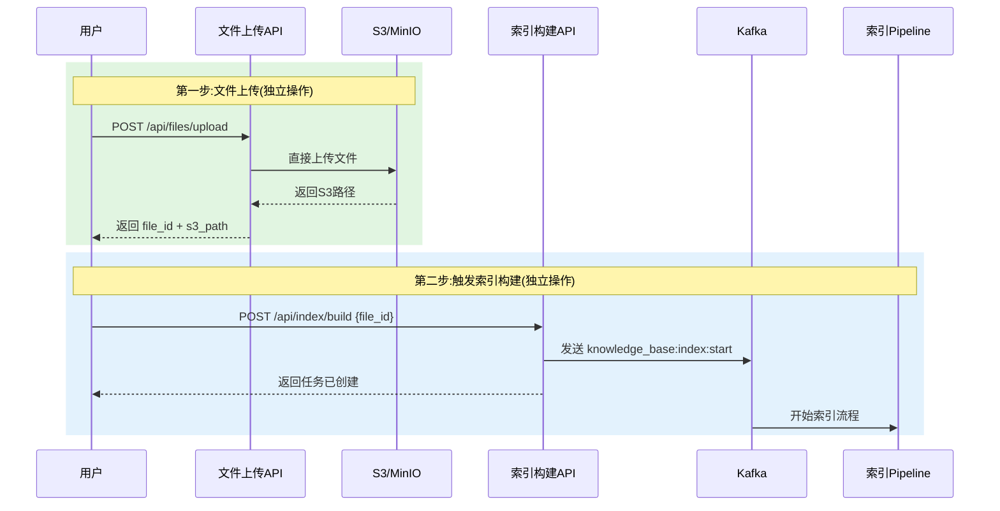

**设计优势**:

| 设计点 | 说明 |
|-------|------|
| **上传与索引解耦** | 用户可以先批量上传文件,再统一触发索引,提高灵活性 |
| **避免Kafka传输大文件** | 文件直接上传到S3,Kafka只传输元数据,节省带宽 |
| **支持重新索引** | 文件已在S3,可以随时重新触发索引,无需重新上传 |
| **独立扩展** | 文件上传和索引构建可以独立扩展,互不影响 |

### 2.3 两层Kafka架构设计

本系统采用**两层Kafka架构**,实现组件解耦和数据库写入优化:

```
┌──────────────────────────────────────────────────────────────────────┐
│                    第一层:组件流转 Kafka                              │
│  knowledge_base:index:start → knowledge_base:parse:end               │
│  → knowledge_base:split:end → knowledge_base:section_summary:end     │
│  → knowledge_base:file_summary:end → ...                             │
│                                                                      │
│  所有组件只做业务逻辑处理,不做Embedding,不写数据库                   │
│  注:文件上传独立于Pipeline,通过API直接上传到S3                      │
└──────────────────────────────────────────────────────────────────────┘
                              ↓
┌──────────────────────────────────────────────────────────────────────┐
│                  第二层:数据库写入 Kafka                              │
│                                                                      │
│  db_write:embedding:start → EmbeddingMilvusWriter → Milvus          │
│  (特殊合并:接收原始文本 → 批量Embedding → 批量写入Milvus)           │
│                                                                      │
│  db_write:graph:start  → Neo4jWriter   → Neo4j                      │
│  db_write:meta:start   → MySQLWriter   → MySQL                      │
│  db_write:mongo:start  → MongoWriter   → MongoDB                    │
└──────────────────────────────────────────────────────────────────────┘
```

### 2.4 Embedding + Milvus 合并设计

**核心设计**: 所有需要向量化的数据都发送到 `db_write:embedding:start` Topic,由统一的 **EmbeddingMilvusWriter** 处理。

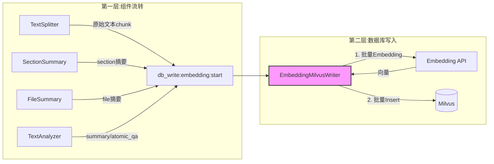

**设计优势**:

| 设计点 | 说明 |
|-------|------|
| **传输原始文本,不传向量** | 原始文本小(几百字节),向量大(6KB),节省Kafka带宽 |
| **统一的Embedding入口** | 所有向量化逻辑集中在一个Writer,便于优化和维护 |
| **批量处理** | Writer可以聚合多条消息,批量调用Embedding API,批量写入Milvus |
| **解耦彻底** | 所有业务组件只做业务逻辑,不关心向量化细节 |

### 2.5 后台阶段依赖关系设计

后台阶段存在明确的依赖关系,需要串行和并行结合。本次重构采用 **自底向上的两级摘要 + 后续并行抽取** 的结构：

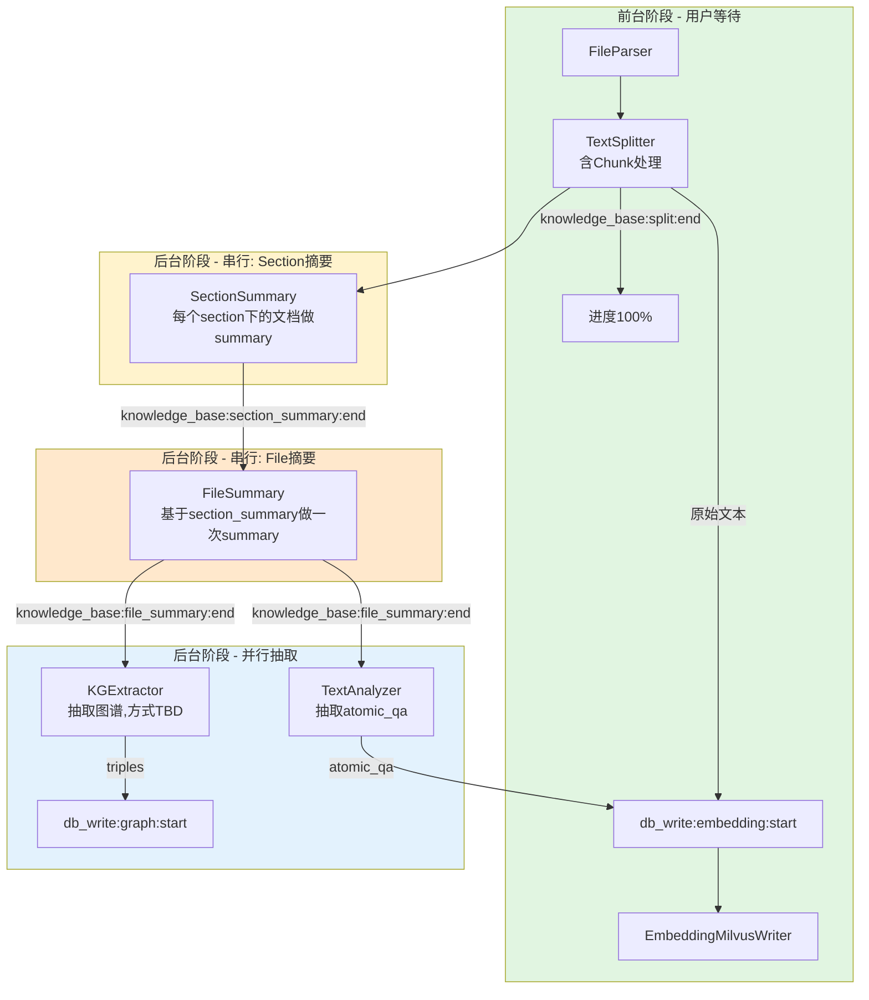

**依赖关系说明**:

| 依赖关系 | 原因 |
|---------|------|
| SectionSummary 在 TextSplitter 后 | 需要每个 section 下的 chunk 内容生成 section 级摘要 |
| FileSummary 在 SectionSummary 后 | file_summary 基于所有 section_summary 汇总生成,自底向上保证摘要质量与层次 |
| KGExtractor 在 FileSummary 后 | KG 抽取参考文件级摘要作为全局上下文(具体抽取方式待定义) |
| TextAnalyzer 在 FileSummary 后 | section 级 atomic_qa 抽取参考文件级摘要作为全局主题锚点 |
| KGExtractor 与 TextAnalyzer 并行 | 两者相互独立,可同时处理 |

**设计要点**:

1. **自底向上两级摘要**：先 section 后 file,避免一次性对全文档做摘要时的上下文丢失与超长输入问题；file_summary 自然汇聚各 section 的要点。
2. **移除图片理解依赖**：TextAnalyzer 不再等待 ImageUnderstand,直接基于 chunk 文本抽取 atomic_qa,链路更短、延迟更低。
3. **KG 抽取方式待定义**：KGExtractor 的具体抽取策略(基于 chunk 还是基于 section_summary、是否分批、prompt 设计等)暂未确定,本版仅固定其在链路中的位置与上下游 Topic。

### 2.6 整体架构图

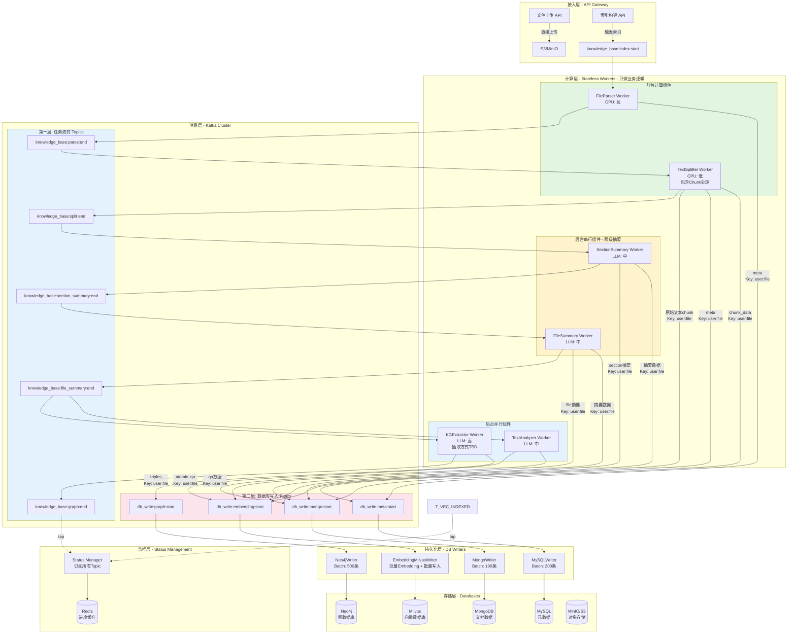

### 2.7 数据流向时序图

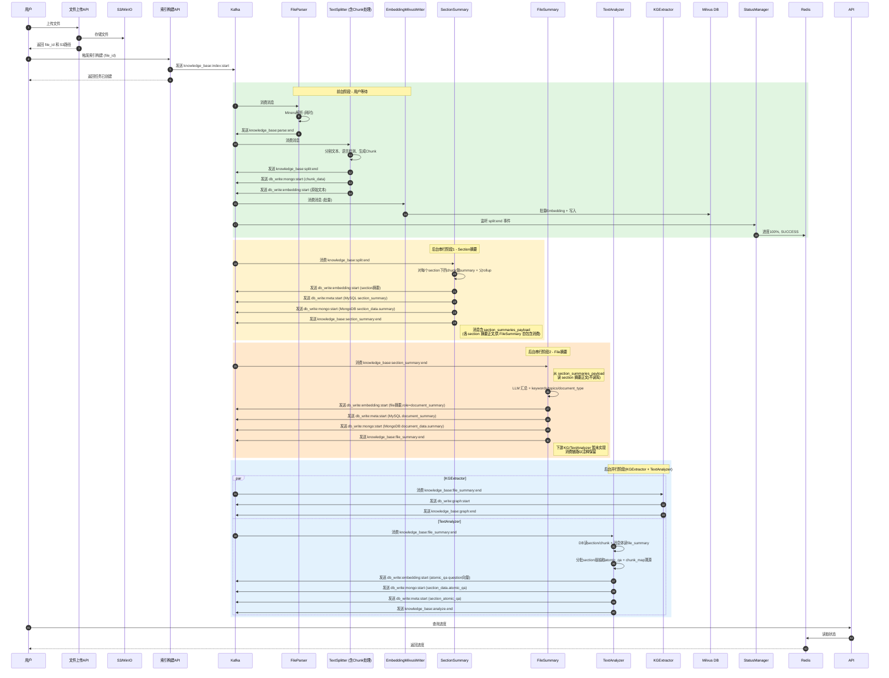

**关键设计**:
1. **前台阶段**:
   - FileParser → `knowledge_base:parse:end` (40%)
   - TextSplitter → `knowledge_base:split:end` (100%, 前台完成)
   - EmbeddingMilvusWriter 在后台批量处理向量写入
2. **后台串行1**: SectionSummary 监听 `knowledge_base:split:end`(对每个 section 下的文档生成 section 级摘要)
3. **后台串行2**: FileSummary 监听 `knowledge_base:section_summary:end`(基于 section 摘要汇总生成 file 摘要)
4. **后台并行**: KGExtractor 和 TextAnalyzer 同时进行(都依赖 file_summary 结果)
5. **统一Key**: 所有消息使用 `user_id:file_id`,保证数据一致性

---

## 3. Kafka Topic 设计

### 3.1 Topic 命名规范

**命名格式**:
```
{业务模块}:{处理阶段}:{事件类型}

业务模块:
- knowledge_base: 知识库索引业务
- db_write: 数据库写入操作
- memory: 对话记忆业务(未来扩展)
- translation: 翻译业务(未来扩展)

事件类型:
- start: 阶段开始
- end: 阶段完成
- error: 阶段失败

示例:
- knowledge_base:index:start(索引构建开始)
- knowledge_base:parse:end(文件解析完成)
- knowledge_base:split:end(文本分割完成,前台100%)
- knowledge_base:section_summary:end(section级摘要完成)
- knowledge_base:file_summary:end(文件级摘要完成)
- db_write:embedding:start(向量数据写入开始)
- db_write:graph:start(图谱数据写入开始)

命名原则:
1. 使用下划线分隔单词,冒号分隔层级(符合常见命名习惯)
2. 业务模块明确标识业务线(knowledge_base、memory等)
3. 处理阶段反映业务流程(parse、split、embedding等)
4. 事件类型明确消息含义(start/end/error)
5. 语义清晰,便于理解和维护
```

### 3.2 Kafka 分区数设计

#### 3.2.1 分区数计算方法

**核心公式**:
```
分区数 = max(
    ceil(生产吞吐量 / 单分区生产吞吐量),
    ceil(消费吞吐量 / 单分区消费吞吐量)
) × 扩容系数
```

**关键参数**:
- **单分区生产吞吐量**: 10 MB/s(Kafka标准值)
- **单分区消费吞吐量**: 20 MB/s(取决于Consumer处理能力)
- **扩容系数**: 1.5-2.0(预留扩容空间)

#### 3.2.2 分区数设计依据

| 维度 | 考虑因素 | 影响 |
|-----|---------|------|
| **并行度** | Consumer数量,决定最大并行处理能力 | 分区数 ≥ Consumer数 |
| **吞吐量** | 生产/消费速率,决定数据流转效率 | 高吞吐→多分区 |
| **延迟要求** | 实时性需求,决定处理响应速度 | 前台多分区,后台少分区 |
| **顺序性** | 消息顺序保证,决定Key分区策略 | 同Key路由到同一分区 |
| **资源成本** | Broker负载、磁盘、内存 | 分区数适度,避免过多 |
| **扩容预留** | 未来业务增长空间 | 预留1.5-2倍空间 |

#### 3.2.3 各Topic分区数设计

##### A. 前台阶段 Topics(用户等待,高优先级)

| Topic名称 | 分区数 | 设计依据 | 预期Consumer数 | 并发瓶颈 |
|-----------|--------|---------|---------------|---------|
| `knowledge_base:index:start` | 32 | 高并发入口,需快速分发 | 10-50 | FileParser速度慢 |
| `knowledge_base:parse:end` | 32 | 承接上游,保持一致 | 20-100 | TextSplitter包含Chunk处理 |
| `knowledge_base:split:end` | 32 | 触发多个Consumer(SectionSummary, StatusManager) | 10-20 | LLM生成摘要 |

**设计说明**:
- **32分区**: 平衡并行度和资源开销
  - 支持最多32个Consumer并行消费(每Consumer独占1个分区)
  - Consumer Group可以有更多实例(分时复用分区)
  - 预留扩容空间: 可扩展到64/128分区
- **为什么不是64?**
  - 当前峰值需求不高(1000文件/小时 ≈ 17文件/分钟)
  - 32分区已足够,避免过度分区导致Broker负载和Rebalance开销
  - 可根据实际Lag情况动态扩容

##### B. 后台阶段 Topics(非实时,中优先级)

| Topic名称 | 分区数 | 设计依据 | 预期Consumer数 | 并发瓶颈 |
|-----------|--------|---------|---------------|---------|
| `knowledge_base:section_summary:end` | 16 | 后台任务,承接split完成 | 10-30 | LLM section摘要速度 |
| `knowledge_base:file_summary:end` | 16 | 后台任务,承接section_summary完成 | 10-30 | LLM file摘要速度 |
| `knowledge_base:graph:end` | 16 | 状态同步,消息量小 | 2-5 | 仅StatusManager消费 |

**设计说明**:
- **16分区**: 后台非实时任务,降低资源成本
  - 消息量相对较小(已完成文件级/section级事件)
  - Consumer数量较少(10-30个)
  - 节省Broker内存和磁盘空间

##### C. 数据库写入 Topics(批量优化,最高吞吐)

| Topic名称 | 分区数 | 设计依据 | 预期Consumer数 | 写入策略 |
|-----------|--------|---------|---------------|---------|
| `db_write:embedding:start` | **32** | 向量写入量最大,核心瓶颈 | 10-50 | 批量Embedding+Milvus |
| `db_write:graph:start` | 16 | 图谱写入量中等 | 2-5 | 大事务批量MERGE |
| `db_write:meta:start` | 32 | 元数据写入频繁 | 3-10 | 批量INSERT/UPDATE |
| `db_write:mongo:start` | 32 | 文档写入量大 | 3-10 | 批量INSERT |

**设计说明**:
- **db_write:embedding:start (32分区)**:
  - 消息量最大: 每文件产生数百条Chunk消息
  - 计算密集: Embedding API调用是瓶颈
  - 高并行度: 需要更多Consumer分摊负载
  - 统一Key为`user_id:file_id`,粒度为文件级,分布均匀
- **其他写入Topic (16-32分区)**:
  - 消息量相对较小
  - 批量写入优化已很高效
  - 分区数适中,避免资源浪费

#### 3.2.4 分区数调整策略

| 触发条件 | 调整方向 | 调整幅度 | 注意事项 |
|---------|---------|---------|---------|
| Lag持续 > 1000 | 增加分区 | 当前分区数 × 2 | 需要重新分配Consumer |
| 消息量下降50% | 减少分区 | 当前分区数 / 2 | 不推荐减少(数据迁移成本高) |
| Consumer扩容 | 增加分区 | 匹配Consumer数 | 确保分区数 ≥ Consumer数 |
| 业务峰值测试 | 提前扩容 | 预留2倍空间 | 在低峰期操作 |

**注意事项**:
1. ⚠️ Kafka只支持增加分区,不支持减少
2. ⚠️ 扩容后需重启Consumer触发Rebalance
3. ⚠️ Key的分区映射会改变,影响顺序性(但本系统可接受)

### 3.3 Kafka Message Key 设计

#### 3.3.1 Key设计原则

| 原则 | 说明 | 重要性 |
|-----|------|--------|
| **数据一致性** | 同一文件的所有消息在同一分区顺序处理,保证向量、元数据、图谱数据一致性 | ⭐⭐⭐⭐⭐ |
| **顺序保证** | 同一Key的消息必须路由到同一分区,保证FIFO顺序 | ⭐⭐⭐⭐⭐ |
| **业务隔离** | 不同用户的消息独立处理,互不影响 | ⭐⭐⭐⭐ |
| **可追溯性** | Key包含核心标识,便于问题排查 | ⭐⭐⭐ |
| **简单性** | 统一Key格式,降低系统复杂度 | ⭐⭐⭐ |

**核心设计理念**: **数据一致性优先于负载均衡**。通过批处理优化性能,通过文件级Key保证数据完整性。

#### 3.3.2 统一Key格式设计

**所有Topic统一Key格式**: `{user_id}:{file_id}`

**设计说明**:

| 字段 | 作用 | 为什么需要 |
|-----|------|----------|
| `user_id` | 用户隔离 | 不同用户的文件独立处理,避免互相影响 |
| `file_id` | 文件唯一标识 | 保证同一文件的所有事件和数据写入在同一分区顺序处理 |

#### 3.3.3 统一Key的核心优势

##### A. 数据一致性保证

**问题场景**: 如果使用不同Key策略(如向量写入用chunk_id),可能出现:
```
文件file_001有100个chunk:
- chunk_001~chunk_050 成功写入Milvus(在分区1-25)
- chunk_051~chunk_100 写入失败(在分区26-50的某些Consumer崩溃)

结果: 文件部分入库,用户检索时只能检索到一半的内容,数据不一致!
```

**统一Key的解决方案**:
```
所有消息使用 user_id:file_id 作为Key:
- 同一文件的所有消息(parse、split、embedding、graph等)路由到同一分区
- 同一分区内的消息顺序处理
- Consumer失败时,整个文件的处理会回滚(Kafka offset不提交)
- 要么全部成功,要么全部失败,保证数据一致性

示例:
knowledge_base:index:start(file_001) → 分区5
knowledge_base:parse:end(file_001) → 分区5
db_write:embedding:start(chunk_001~chunk_100) → 全部在分区5
db_write:graph:start(file_001) → 分区5
db_write:meta:start(file_001) → 分区5

分区5的Consumer顺序处理,任何环节失败都可以重试整个文件。
```

##### B. 简化事务管理

**统一Key带来的简化**:

| 方面 | 多种Key策略 | 统一Key策略 |
|-----|------------|------------|
| **消息顺序** | 不同类型消息可能乱序 | 严格FIFO顺序 |
| **失败重试** | 需要复杂的分布式事务协调 | 简单的Consumer offset管理 |
| **状态追踪** | 需要跨分区追踪文件状态 | 单分区内完整状态 |
| **幂等性** | 需要复杂的去重逻辑 | 简单的event_id去重 |
| **一致性保证** | 需要Two-Phase Commit | Kafka原生的at-least-once语义即可 |

##### C. 性能优化策略

**虽然所有消息在同一分区,但性能不会成为瓶颈**:

1. **批处理优化**:
```
EmbeddingMilvusWriter批量处理:
- 即使500个chunk消息在同一分区,也会批量处理
- 缓冲100条消息或500ms
- 批量调用Embedding API(一次请求处理64条)
- 批量写入Milvus(一次插入100条)

单文件500个chunk的处理时间:
- 不批处理: 500次Embedding API调用 = 500 * 100ms = 50s
- 批处理: 8次Embedding API调用 = 8 * 100ms = 0.8s

批处理带来60倍性能提升!
```

2. **横向扩展**:
```
虽然单个文件在同一分区,但不同文件在不同分区:
- 32个分区 = 最多32个文件并行处理
- 每个分区可以有多个Consumer实例(分时复用)
- 总并发度 = 32分区 × Consumer并发度

实际效果:
- 1000个文件/小时 ≈ 17个文件/分钟
- 32个分区足够分散负载
- 单个文件处理时间: 3-5分钟(包含解析、向量化、写入)
- 32个分区可以同时处理32个文件 = 192个文件/小时 > 需求
```

##### D. 负载均衡效果

**Key分布分析**:
```
分区计算(Kafka默认Hash算法):
partition = hash(key) % num_partitions

示例: 32分区
hash("user_abc123:file_001") % 32 = 5   # 分区5
hash("user_abc123:file_002") % 32 = 18  # 分区18
hash("user_abc123:file_003") % 32 = 27  # 分区27
hash("user_def456:file_001") % 32 = 12  # 分区12

负载均衡效果:
- 不同file_id → 不同hash → 均匀分布到不同分区
- 相同file_id → 相同分区 → 保证顺序和一致性
- 用户A的1000个文件会分散到约31-32个分区(均匀分布)
```

**热点分区处理**:
```
极端情况: 某个用户短时间上传100个文件
即使分布不均,也不会有单点瓶颈:

最坏情况: 100个文件全部hash到同一分区(概率极低)
解决方案:
1. 该分区的Consumer会缓慢处理(但不影响其他31个分区)
2. 可以动态增加该Consumer的并发度
3. 可以扩展分区数(从32 → 64)

实际情况: Hash算法保证均匀分布
100个文件大约分布到: 100 / 32 ≈ 3-4个文件/分区
每个分区处理3-4个文件 × 3分钟 = 9-12分钟
完全可接受的延迟
```

#### 3.3.4 Key设计总结

| Topic类型 | Key格式 | 分区策略 | 顺序保证 | 数据一致性 | 适用场景 |
|----------|---------|---------|---------|-----------|---------|
| **所有Topic** | `user_id:file_id` | Hash(key) % N | 文件级FIFO | 完整性保证 | 保证同一文件所有数据在同一分区顺序处理 |

**统一Key的核心价值**:
- ✅ **数据一致性**: 向量、元数据、图谱要么全部成功,要么全部失败
- ✅ **简化设计**: 无需复杂的分布式事务协调
- ✅ **易于追踪**: 同一文件的所有消息在同一分区,便于问题排查
- ✅ **批处理优化**: 性能通过Writer层的批处理保证,而非分区分散

### 3.4 任务流转 Topic 定义

#### 3.4.1 前台阶段 Topics

| Topic名称 | Partitions | Message Key | 分区策略 | 生产者 | 消费者组 | 消息保留 | 说明 |
|-----------|------------|-------------|---------|--------|----------|----------|------|
| `knowledge_base:index:start` | 32 | `{user_id}:{file_id}` | Hash(key) % 32 | 索引构建API | `group-file-parser` | 7天 | 索引构建入口(文件已上传到S3) |
| `knowledge_base:parse:end` | 32 | `{user_id}:{file_id}` | Hash(key) % 32 | FileParser | `group-text-splitter` | 7天 | 文件解析完成 |
| `knowledge_base:split:end` | 32 | `{user_id}:{file_id}` | Hash(key) % 32 | TextSplitter | `group-file-summary`, `group-status-manager` | 3天 | 文本分割完成(前台进度100%) |

#### 3.4.2 后台阶段 Topics

| Topic名称 | Partitions | Message Key | 分区策略 | 生产者 | 消费者组 | 消息保留 | 说明 |
|-----------|------------|-------------|---------|--------|----------|----------|------|
| `knowledge_base:section_summary:end` | 16 | `{user_id}:{file_id}` | Hash(key) % 16 | SectionSummary | `group-file-summary`, `group-status-manager` | 3天 | section级摘要完成,触发FileSummary |
| `knowledge_base:file_summary:end` | 16 | `{user_id}:{file_id}` | Hash(key) % 16 | FileSummary | `group-kg-extractor`, `group-text-analyzer`, `group-status-manager` | 3天 | 文件级摘要完成,触发后台KG抽取和文本分析 |
| `knowledge_base:analyze.end` | 16 | `{user_id}:{file_id}` | Hash(key) % 16 | TextAnalyzer | `group-status-manager` | 3天 | 文本分析（atomic_qa 抽取）完成,供 status manager 标记后台阶段完成 |
| `knowledge_base:graph:end` | 16 | `{user_id}:{file_id}` | Hash(key) % 16 | KGExtractor | `group-status-manager` | 3天 | 知识图谱抽取完成 |

### 3.5 数据库写入 Topic 定义(第二层Kafka)

第二层Kafka专门用于数据库写入操作,实现批量聚合优化。

| Topic名称 | Partitions | Message Key | 分区策略 | 生产者 | 消费者组 | Batch策略 | 说明 |
|-----------|------------|-------------|---------|--------|----------|-----------|------|
| `db_write:embedding:start` | 32 | `{user_id}:{file_id}` | Hash(key) % 32 | TextSplitter, SectionSummary, FileSummary, TextAnalyzer | `group-db-writer` | 100条/500ms | **核心**: 原始文本 → Embedding → Milvus |
| `db_write:graph:start` | 16 | `{user_id}:{file_id}` | Hash(key) % 16 | KGExtractor | `group-db-writer` | 500条/2s | 图谱写入 |
| `db_write:meta:start` | 32 | `{user_id}:{file_id}` | Hash(key) % 32 | All Workers | `group-db-writer` | 200条/1s | 元数据写入 |
| `db_write:mongo:start` | 32 | `{user_id}:{file_id}` | Hash(key) % 32 | TextSplitter, SectionSummary, FileSummary, TextAnalyzer | `group-db-writer` | 100条/500ms | 文档数据写入 |

**核心设计**: `db_write:embedding:start` 是特殊的合并Topic,消息内容是**原始文本**(不是向量),由 **EmbeddingMilvusWriter** 统一处理 Embedding + Milvus 写入。

**向量化数据来源**:
| 组件 | 发送内容 | 目标Collection |
|-----|---------|---------------|
| TextSplitter | 原始文本chunk | chunk_store_zh/en |
| SectionSummary | section级摘要 | section_summary_store_zh/en |
| FileSummary | file级摘要 | summary_store_zh/en |
| TextAnalyzer | atomic_qa(question) | atomic_qa_store |

### 3.6 S3目录结构设计

#### 3.6.1 目录结构设计原则

**核心原则**:
1. 按用户隔离: 便于权限控制和数据清理
2. 按会话(session)组织: 支持批量操作和版本管理
3. 保留原始目录结构: 便于追溯和重新处理

#### 3.6.2 目录结构

```
s3://knowledge-bucket/
  └── users/
      └── {user_id}/
          └── sessions/
              └── {session_id}/
                  ├── raw/                    # 原始文件
                  │   ├── {file_id}/
                  │   │   └── {original_filename}
                  │   └── ...
                  └── parsed/                 # 解析结果
                      ├── {file_id}/
                      │   └── images/
                      │       ├── img_001.png
                      │       └── ...
                      └── ...

说明:
- user_id: 用户唯一标识
- session_id: 上传会话ID(支持批量上传场景)
- file_id: 文件唯一标识
- raw/: 存储原始上传文件
- parsed/: 存储解析出的图片文件
```

#### 3.6.3 Session设计

**Session概念**:
- 一次上传会话可以包含多个文件
- Session_id格式: `session_{timestamp}_{random}`
- 支持批量操作: 一次上传多个文件,统一触发索引
- 便于版本管理: 相同文件的不同版本在不同session

#### 3.6.4 S3目录结构的优势

| 优势 | 说明 |
|-----|------|
| **用户隔离** | 每个用户的数据在独立目录,便于权限控制 |
| **批量管理** | Session级别的组织,支持批量上传和索引 |
| **版本管理** | 同一文件的不同版本在不同session,便于追溯 |
| **数据清理** | 按user_id或session_id批量删除数据 |
| **权限控制** | 可以针对user_id设置S3 IAM策略 |
| **可追溯性** | 保留原始文件和图片资源,便于问题排查 |
| **成本优化** | 可以按user_id或session_id设置生命周期策略 |
| **存储优化** | PDF结构化信息存储在MySQL,S3只存储原始文件和图片 |

---

## 4. 计算组件设计

### 4.1 FileParser Worker

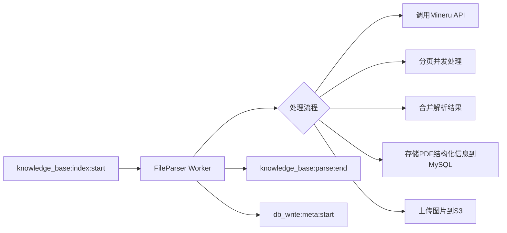

**职责**:
- 调用Mineru引擎进行PDF解析
- 分页并发处理提高效率
- 提取PDF的结构化信息和图片
- 将PDF结构化信息存储到数据库
- 上传图片到对象存储

**处理逻辑**:
1. 从S3下载PDF文件
2. 拆分页面并发调用Mineru API(每2页一批)
3. 合并解析结果
4. 将PDF结构化信息（页数、布局信息等元数据）存储到MySQL
5. 上传图片到S3
6. 发送解析完成事件

### 4.2 TextSplitter Worker(包含Chunk处理)

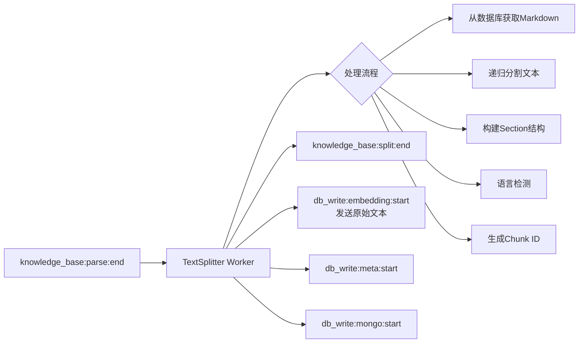

**职责**:
- 智能文本分割(保持语义完整)
- 构建Section层级结构
- 语言检测和分组
- 直接发送原始文本到向量化队列
- 存储Chunk元数据和内容

**核心优化**:
- 将 TextSplitter 和 ChunkProcessor 合并
- 从数据库直接读取解析数据,避免中间文件传输
- 文本分块后直接在内存中处理,无需中间存储
- 直接发送原始文本到向量化队列

**处理逻辑**:
1. 从MySQL数据库获取PDF解析后的结构化数据
2. 使用递归分割算法切分文本
3. 构建Section-Chunk层级关系
4. 检测每个Chunk的语言
5. 直接发送原始文本到 `db_write:embedding:start`
6. 批量写入元数据和文档数据

### 4.3 SectionSummary Worker

**职责**:
- 监听 `knowledge_base:split:end` 事件
- 对每个 Section 下的文档内容(所属 chunk)生成 section 级摘要
- 为 FileSummary 提供自底向上的汇总素材
- 使用 LLM 生成高质量摘要

**处理流程**:
1. 监听 `knowledge_base:split:end` 事件
2. 按 section_id 聚合其下所有 chunk 内容
3. 对每个 section 调用 LLM 生成 section 摘要(可并发处理多个 section)
4. 发送 section 摘要到 `db_write:embedding:start`(section摘要向量化)
5. 发送 section 摘要数据到 `db_write:mongo:start` / `db_write:meta:start`
6. 发送 `knowledge_base:section_summary:end` 事件

### 4.4 FileSummary Worker

**职责**:
- 监听 `knowledge_base:section_summary:end` 事件
- 从 `SectionSummaryEndMessage` 的自包含 `section_summaries_payload` 字段读取所有 section 摘要正文（**不读数据库**，消除写库竞态）
- 基于 section 摘要列表调用 LLM 汇总生成文件级摘要(file_summary)，同时产出 keywords / topics / document_type
- 为后续 KG 抽取和文本分析提供全局上下文
- 使用 LLM 生成高质量摘要

**处理流程**:
1. 监听 `knowledge_base:section_summary:end` 事件
2. 从消息体 `section_summaries_payload` 读取各 section 摘要正文（不读库）
3. 调用 `FileSummaryService` → LLM 对 section 摘要做一次汇总,生成 file_summary + keywords + topics + document_type
4. 发送 file 摘要到 `db_write:embedding:start`(file摘要向量化,role=document_summary)
5. 发送 file 摘要数据到 `db_write:mongo:start`(MongoDB document_data.summary 结构化子文档) / `db_write:meta:start`(MySQL document_summary 表)
6. 发送 `knowledge_base:file_summary:end` 事件

> ⚠️ **下游接通状态**: `KGExtractorWorker` 与 `TextAnalyzerWorker` 尚未实现,当前 `FileSummaryWorker` 发送 `SummaryEndMessage` 后,下游消费链路暂以注释形式保留,待后续两个 Worker 落地后取消注释接通。`FileSummary` 自身的摘要生成与三路落库不受影响,可独立运行。

**代码分层**（与 SectionSummary 对齐）:
```
src/index/common_file_extract/extract/
├── file_summary_context.py      # payload → section 摘要列表
├── file_summary_summarizer.py   # LLM 汇总 + 重试
└── __init__.py
src/service/knowledge/components/file_summary_service.py  # 编排层
src/types/models/file_summary_result.py                    # DTO
src/prompts/background/file_summary.py                     # prompt 构造
```

### 4.5 KGExtractor Worker

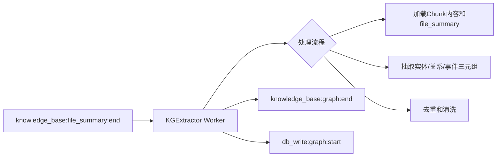

**职责**:
- 抽取知识三元组(实体关系、事件实体、事件关系)
- 参考 file_summary 作为全局上下文
- 三元组去重和清洗
- 发送图谱写入消息

**处理逻辑**:
1. 加载 Chunk 内容和 file_summary
2. 抽取实体关系、事件实体、事件关系三元组
3. 去重和质量过滤
4. 发送图谱写入消息

> ⚠️ **抽取方式待定义**: 本版仅固定 KGExtractor 在链路中的位置(监听 `file_summary:end`、产出 `graph:end` 与 `db_write:graph:start`)。具体的抽取策略(基于 chunk 还是 section_summary、是否分批、prompt 与 schema 设计、是否引入事理图谱等)暂未确定,待后续补充设计。

### 4.6 TextAnalyzer Worker

**职责**:
- 监听 `knowledge_base:file_summary:end` 事件
- 在 **section 级**抽取 atomic_qa（原子问答对），用于精确问答召回
- 通过 **chunk_map** 机制保留 chunk 级溯源
- 参考 file_summary 作为全局主题锚点

**处理流程**:
1. **混合取数**：section 正文 + chunk 列表从 DB 读（Mongo `section_data` + `chunk_data` by `document_id`，此时已稳定入库）；`file_summary` 从 `SummaryEndMessage` 消息体读（其自身落库异步、不保证先到）。
2. 按 N chunk/批对 section 分批（超长 section 处理，N 由分块策略推导），每批为 chunk 分配代号 `〔Cn〕`，建立本批 `chunk_map`。
3. 每批调用 LLM（输入 = section 标题 + 带代号的批内全文 + file_summary）抽取 atomic_qa，每对 QA 携带 `source_chunk_codes`，数量典型 3~5（上限 8，按 section 整体计）。
4. 用本批 `chunk_map` 将 `source_chunk_codes` 替换为真实 `chunk_id` → `source_chunk_ids`；批间汇总后做语义去重 + section 整体数量上限截断。
5. 产出:
   - QA 向量 → `db_write:embedding:start`（Milvus `atomic_qa_store`,仅 question 建向量,scalar: qa_id/section_id/document_id）
   - QA 内容 → `db_write:mongo:start`（MongoDB `section_data.atomic_qa` 字段）
   - QA 元数据 → `db_write:meta:start`（MySQL `section_atomic_qa`）
6. 发送 `knowledge_base:analyze.end`（供 status manager 标记后台阶段完成）。

**设计要点**:
- **混合取数**：链路末端对「自包含不读库」的有意突破——section/chunk 已稳定入库故读 DB，file_summary 落库异步故读消息体。
- **分批抽取**：超长 section 按 N chunk/批滑窗，每批独立 chunk_map + LLM 调用，批间语义去重；短 section 退化为单批。
- **section 级抽取**：一次调用看全 section（或单批），主题对齐、控量、跨 chunk 去重，避免 chunk 级抽取的琐碎问题。
- **chunk_map 溯源**：LLM 只看代号，后处理替换为真实 chunk_id，QA 精确溯源到具体 chunk。
- **存储归属 section_data**：QA 可横跨多 chunk，存 `section_data` 最自洽，`source_chunk_ids` 承载 chunk 级溯源。
- **质量控制**：file_summary 主题锚点 + prompt 类型白名单/自包含/数量上限 + LLM 自评 relevance + 廉价向量相关度后过滤。
- **下游接通**：发送 `analyze.end` 供 status manager 标记后台完成；v1.0 遗留 `chunk_atomic_qa` 表/ORM/Repo 彻底删除，统一用 `section_atomic_qa`。
- 详细方案见《通用文件高级语义索引召回设计》「文本分析（QA抽取）」。

> **变更说明**:
> - 原设计依赖 ImageUnderstand 的图片理解结果。移除图像理解后,TextAnalyzer 直接基于文本抽取,不再处理图片描述。
> - 原设计同时生成 chunk summary 与 atomic_qa，本次重构**移除 chunk summary**，仅抽取 atomic_qa。
> - 抽取粒度由 chunk 级改为 **section 级**,并通过 **chunk_map** 保留 chunk 级溯源;存储归属由 chunk_data 改为 `section_data`。
> - v1.1 取数改为「DB + Message 混合」；新增超长 section 分批抽取；新增 `analyze.end` topic；删除 v1.0 `chunk_atomic_qa` 遗留。

---

## 5. 数据库 Writer 设计

### 5.1 Writer 设计理念

**核心特性**:
1. 批量聚合写入
2. 可配置的批次大小和时间窗口
3. 写入成功后发送确认消息
4. 失败重试和死信队列

**批处理策略**:
```
缓冲消息直到:
- 达到 batch_size 条数, 或
- 达到 flush_interval_ms 时间窗口

然后批量写入数据库
```

### 5.2 EmbeddingMilvusWriter(核心: Embedding + Milvus 合并)

**核心设计**: 这是整个架构的关键组件。它消费 `db_write:embedding:start` Topic,接收**原始文本**,统一处理 Embedding + Milvus 写入。

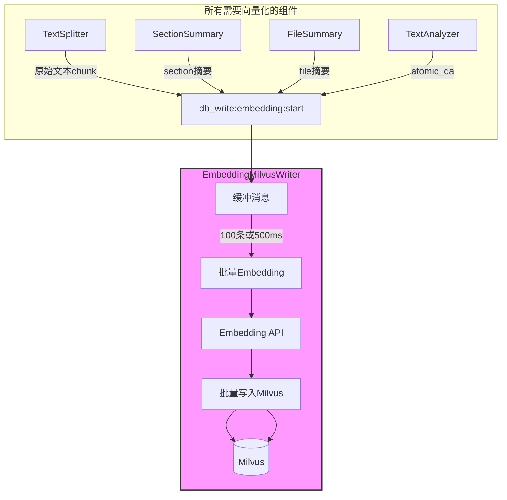

**为什么这样设计**:
| 设计点 | 说明 |
|-------|------|
| **传输原始文本** | 文本小(几百字节),向量大(6KB),节省Kafka带宽 |
| **统一入口** | 所有向量化逻辑集中处理,便于优化(缓存、去重等) |
| **批量处理** | 聚合多条消息,批量Embedding,批量写入Milvus |
| **解耦彻底** | 业务组件不关心向量化细节,专注业务逻辑 |
| **异步处理** | Writer在后台处理,不阻塞前台流程 |

**配置参数**:
- Batch Size: 100条
- Flush Interval: 500ms
- Embedding Batch Size: 64条/请求
- Milvus Insert Batch Size: 100条/次

**处理逻辑**:
1. 缓冲消息直到 batch_size 或 flush_interval
2. 按Collection分组
3. 批量调用Embedding API
4. 批量写入Milvus
5. 在后台异步处理,不发送完成事件

**性能优化**:
```
单文件500个chunk的处理:
- 所有chunk在同一分区,由1个Consumer顺序接收
- Consumer缓冲100条后批量处理
- 5批次 × (Embedding 0.8s + Milvus写入 0.2s) = 5s
- 相比单条处理(500 × 0.1s = 50s),性能提升10倍
```

### 5.3 Neo4jWriter

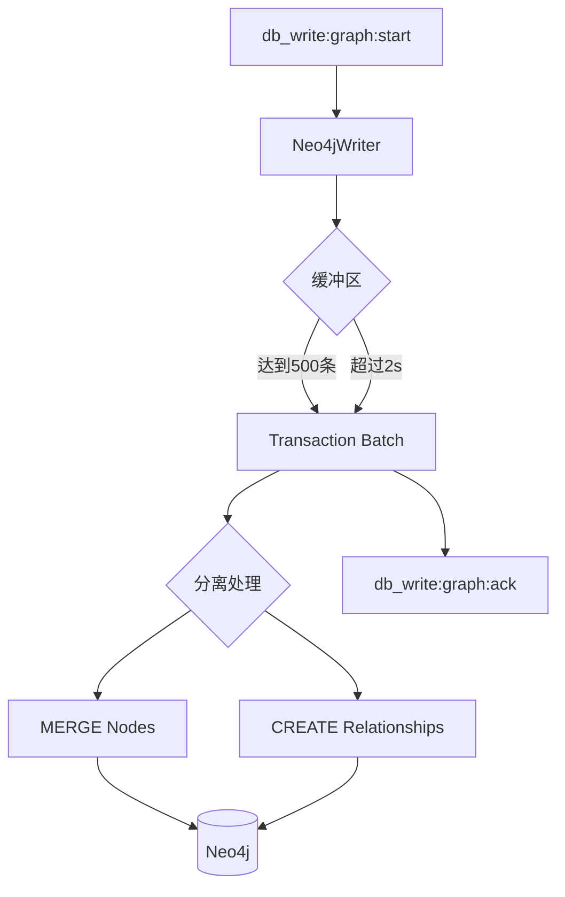

**配置参数**:
- Batch Size: 500条
- Flush Interval: 2000ms

**优化策略**:
1. 大事务批量处理(batch_size=500)
2. 使用UNWIND批量MERGE
3. 先处理节点,再处理关系
4. 避免死锁的单线程写入

**处理逻辑**:
1. 聚合所有节点和关系
2. 批量MERGE节点(使用UNWIND)
3. 批量CREATE关系
4. 发送写入完成确认

### 5.4 MySQLWriter

**配置参数**:
- Batch Size: 200条
- Flush Interval: 1000ms

**优化策略**:
1. 批量INSERT/UPDATE(batch_size=200)
2. 使用executemany批量操作
3. 按表分组处理

**处理逻辑**:
1. 按表分组消息
2. 区分INSERT和UPDATE操作
3. 批量执行SQL
4. 提交事务

### 5.5 MongoWriter

**配置参数**:
- Batch Size: 100条
- Flush Interval: 500ms

**优化策略**:
1. 批量INSERT(batch_size=100)
2. 按collection分组
3. 使用bulk_write批量操作

**处理逻辑**:
1. 按collection分组消息
2. 批量写入文档
3. 发送写入完成确认

---

## 6. 状态管理与进度追踪

### 6.1 Status Manager 设计

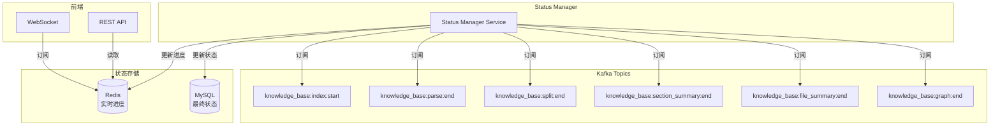

**关键事件与进度**:
| 事件 | 进度 | 说明 |
|-----|------|-----|
| `knowledge_base:index:start` | 10% | 索引构建开始(文件已在S3) |
| `knowledge_base:parse:end` | 40% | 文件解析完成 |
| `knowledge_base:split:end` | 100% | **前台完成**,文本分割完成,用户可检索 |
| `knowledge_base:section_summary:end` | - | 后台: section级摘要完成 |
| `knowledge_base:file_summary:end` | - | 后台: 文件级摘要完成 |
| `knowledge_base:graph:end` | - | 后台: KG流程完成 |

**说明**:
- `knowledge_base:split:end`: 前台阶段的关键事件,由 TextSplitter 发送。文本分割完成,chunk数据已准备好,EmbeddingMilvusWriter在后台异步处理向量化。Status Manager 监听此事件后更新进度为100%,用户可立即开始检索
- SectionSummary 监听 `knowledge_base:split:end` 事件,生成 section 级摘要;FileSummary 监听 `knowledge_base:section_summary:end` 事件,生成 file 级摘要

### 6.2 进度权重配置

**进度权重映射**:
```
knowledge_base:index:start:           10%  (索引开始)
knowledge_base:parse:end:             40%  (解析完成)
knowledge_base:split:end:            100%  (前台完成,用户可检索)

后台阶段不影响前台进度:
knowledge_base:section_summary:end:  None
knowledge_base:file_summary:end:     None
knowledge_base:graph:end:            None
```

### 6.3 状态更新流程

**处理逻辑**:
1. 订阅所有关键事件Topic
2. 根据事件类型计算进度
3. 更新Redis实时进度
4. 发布进度变更事件(供WebSocket推送)
5. `knowledge_base:split:end` 事件触发时,更新MySQL状态为SUCCESS(前台完成)

**Redis Key设计**:
```
file:progress:{file_id}  -> 进度百分比
TTL: 24小时
```

**MySQL状态字段**:
```
file_meta_info表:
- status: PENDING/PROCESSING/SUCCESS/FAILED
- message: 状态描述信息
- progress: 进度百分比
- updated_at: 更新时间
```

### 6.4 进度查询接口

**REST API**:
```
GET /api/files/{file_id}/progress

Response:
{
  "file_id": "file_001",
  "progress": 1.0,
  "status": "success",
  "stage": "knowledge_base:split:end",
  "message": "前台处理完成,可以检索"
}
```

**WebSocket实时推送**:
```
WS /ws/progress/{user_id}

Message:
{
  "file_id": "file_001",
  "progress": 1.0,
  "stage": "knowledge_base:split:end",
  "timestamp": 1706227400000
}
```

---

## 7. 错误处理与容错设计

### 7.1 死信队列 (DLQ) 设计

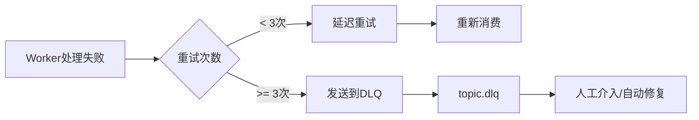

**DLQ策略**:
- 每个Topic都有对应的DLQ
- 格式: `{topic_name}.dlq`
- 保留原始消息和错误信息
- 支持重新回放到正常队列

### 7.2 重试策略

**重试配置**:
- 最大重试次数: 3次
- 重试延迟: [1秒, 5秒, 30秒]
- 重试Topic: `{topic_name}.retry`

**重试流程**:
1. Worker处理失败,检查重试次数
2. 如果 < 3次,发送到延迟队列
3. 延迟队列定时重新投递到正常队列
4. 如果 >= 3次,发送到死信队列

### 7.3 幂等性保证

**幂等性设计**:
- 每条消息有唯一的 `event_id`
- Writer使用 `event_id` 去重
- 去重缓存: Redis (24小时过期)
- 内存缓存 + Redis双层去重

**去重流程**:
1. 先查内存缓存(快速判断)
2. 再查Redis缓存(持久化判断)
3. 如果已处理,跳过
4. 如果未处理,执行写入并标记

### 7.4 容错机制

**Consumer容错**:
- 手动提交offset
- 批量消息全部成功后才提交
- 失败后重新消费

**Writer容错**:
- 批量写入失败后,拆分为小批次重试
- 记录失败的记录ID
- 发送失败通知

**状态一致性保证**:
- 同一文件的所有消息在同一分区
- 分区内顺序处理
- 失败回滚整个文件的处理

---

## 8. 部署与扩容策略

### 8.1 组件部署配置

#### 8.1.1 前台阶段 Workers

| 组件 | 实例数 | 资源配置 | 扩容触发条件 | 说明 |
|-----|--------|---------|-------------|------|
| FileParser Worker | 10 | 4 CPU, 16GB RAM, 1 GPU | Kafka lag > 50 | GPU密集型(Mineru) |
| TextSplitter Worker | 20 | 2 CPU, 4GB RAM | Kafka lag > 200 | CPU密集型(包含Chunk处理) |

#### 8.1.2 后台串行 Workers

| 组件 | 实例数 | 资源配置 | 扩容触发条件 | 说明 |
|-----|--------|---------|-------------|------|
| SectionSummary Worker | 10 | 4 CPU, 8GB RAM | Kafka lag > 50 | LLM生成section级摘要(可按section并发) |
| FileSummary Worker | 10 | 4 CPU, 8GB RAM | Kafka lag > 50 | LLM基于section_summary生成file摘要 |

#### 8.1.3 后台并行 Workers

| 组件 | 实例数 | 资源配置 | 扩容触发条件 | 说明 |
|-----|--------|---------|-------------|------|
| KGExtractor Worker | 10 | 4 CPU, 8GB RAM | Kafka lag > 50 | 统一KG三元组抽取(抽取方式待定义) |
| TextAnalyzer Worker | 10 | 4 CPU, 8GB RAM | Kafka lag > 50 | LLM抽取chunk级atomic_qa |
| StatusManager | 2 | 1 CPU, 2GB RAM | 高可用备份 | 状态监控 |

#### 8.1.4 数据库 Writers

| 组件 | 实例数 | 资源配置 | 扩容触发条件 | 说明 |
|-----|--------|---------|-------------|------|
| **EmbeddingMilvusWriter** | 10 | 4 CPU, 8GB RAM | Kafka lag > 500 | **核心**: Embedding + Milvus合并 |
| Neo4jWriter | 2 | 2 CPU, 4GB RAM | Kafka lag > 200 | 图谱批量写入 |
| MySQLWriter | 3 | 2 CPU, 4GB RAM | Kafka lag > 500 | 元数据批量写入 |
| MongoWriter | 3 | 2 CPU, 4GB RAM | Kafka lag > 300 | 文档批量写入 |

### 8.2 Kubernetes HPA 配置

**水平自动扩缩容**:
- 基于Kafka Consumer Lag指标
- 使用Prometheus监控
- 配置扩容阈值和缩容阈值
- 预留最小实例数保证可用性

**HPA指标**:
- 扩容触发: Lag > 配置阈值
- 缩容触发: Lag < 阈值/2 且持续5分钟
- 最大实例数: 3倍最小实例数

### 8.3 Kafka 集群配置

**Topic配置**:
- 分区数: 前台32,后台16,向量写入32
- 副本因子: 3
- 最小同步副本: 2

**性能优化**:
- Batch Size: 65536
- Linger Time: 5ms
- Compression: lz4
- Max Poll Records: 500

**消费者配置**:
- Fetch Min Bytes: 1024
- Fetch Max Wait: 500ms
- Session Timeout: 30s
- Heartbeat Interval: 3s

---

## 9. 监控与可观测性

### 9.1 核心监控指标

#### 9.1.1 Kafka指标

| 指标名称 | 告警阈值 | 说明 |
|---------|---------|------|
| consumer_lag | > 1000 | 消费者落后 |
| messages_per_sec | < 10 | 吞吐量下降 |
| partition_lag | > 500 | 分区堆积 |
| consumer_fetch_latency | > 1s | 拉取延迟 |

#### 9.1.2 Worker指标

| 指标名称 | 告警阈值 | 说明 |
|---------|---------|------|
| process_duration_p99 | > 30s | 处理延迟 |
| error_rate | > 5% | 错误率 |
| retry_count | > 100/min | 重试频繁 |
| dlq_count | > 10/hour | 死信队列堆积 |

#### 9.1.3 数据库指标

| 指标名称 | 告警阈值 | 说明 |
|---------|---------|------|
| write_latency_p99 | > 1s | 写入延迟 |
| connection_pool_usage | > 80% | 连接池饱和 |
| batch_size_avg | < 50 | 批处理效率下降 |
| query_duration_p99 | > 500ms | 查询延迟 |

### 9.2 分布式追踪

**追踪设计**:
- 使用OpenTelemetry标准
- 每个消息携带 `trace_id`
- 跨组件透传 `trace_id`
- 记录每个处理阶段的耗时

**追踪信息**:
- Span Name: 组件名.操作名
- Span Attributes:
  - file_id
  - user_id
  - knowledge_id
  - trace_id
  - stage

### 9.3 日志聚合

**日志设计**:
- 结构化日志(JSON格式)
- 统一日志字段
- 包含 `trace_id` 便于关联

**日志级别**:
- ERROR: 错误信息,需要人工介入
- WARN: 警告信息,可能影响性能
- INFO: 关键操作信息
- DEBUG: 调试信息

### 9.4 告警策略

**告警等级**:
- P0: 服务不可用,立即处理
- P1: 严重影响功能,30分钟内处理
- P2: 性能下降,2小时内处理
- P3: 潜在问题,1天内处理

**告警渠道**:
- P0/P1: 电话 + 短信 + 企业微信
- P2: 企业微信 + 邮件
- P3: 邮件

---

## 10. 总结

### 10.1 架构优势

| 特性 | 传统架构(同步Pipeline) | 事件驱动架构(EDA) |
|-----|---------------------|----------------|
| 并发模型 | 线性/线程池 | 全异步消费者 |
| 慢组件影响 | 阻塞整个线程 | 仅Topic积压 |
| 资源利用 | GPU等待IO | 计算IO分离 |
| 数据库写入 | 单条小批量 | 两层Kafka + 批量Writer |
| 扩容方式 | 整体扩容 | 按需独立扩容 |
| 容错能力 | 重启丢失 | Kafka持久化 |
| 向量写入 | 组件内处理 | **统一Writer**(Embedding+Milvus合并,异步处理) |
| KG抽取 | 多组件分离 | **统一KGExtractor**(单组件完成全部抽取) |
| Chunk处理 | 分离组件+S3传输 | **TextSplitter合并**(内存处理,零中间存储) |
| 数据一致性 | 无保证 | **文件级事务**(统一Key保证) |
| Topic命名 | 不规范 | **业务语义化**(knowledge_base:*:*) |
| 前台进度 | 等待向量写入 | **split完成即可检索**(向量化异步进行) |

### 10.2 完整流程设计

**阶段0: 文件上传(独立于Pipeline)**
```
用户 → 文件上传API → S3 → 返回 file_id + s3_path
```

**阶段1: 触发索引(用户决定何时索引)**
```
用户 → 索引构建API(file_id) → knowledge_base:index:start → Pipeline启动
```

**阶段2: 前台阶段(用户等待)**
```
┌──────────────────────────────────────────────────────────────────┐
│                    前台阶段(用户等待)                            │
│  FileParser(从S3下载) → knowledge_base:parse:end (40%)          │
│          ↓                                                       │
│  TextSplitter (含Chunk处理) → knowledge_base:split:end (100%)   │
│          ↓                                                       │
│  发送 db_write:embedding:start → EmbeddingMilvusWriter(后台异步) │
│                                                                  │
│  所有消息Key: user_id:file_id(保证数据一致性)                   │
└──────────────────────────────────────────────────────────────────┘
                              ↓
┌──────────────────────────────────────────────────────────────────┐
│              后台串行阶段1 - SectionSummary                       │
│  knowledge_base:split:end → SectionSummary                       │
│  (对每个section下的文档做summary)                                │
│  → knowledge_base:section_summary:end                            │
└──────────────────────────────────────────────────────────────────┘
                              ↓
┌──────────────────────────────────────────────────────────────────┐
│              后台串行阶段2 - FileSummary                          │
│  knowledge_base:section_summary:end → FileSummary                │
│  (基于section_summary做一次summary,得到file_summary)            │
│  → knowledge_base:file_summary:end                               │
└──────────────────────────────────────────────────────────────────┘
                              ↓
┌──────────────────────────────────────────────────────────────────┐
│                    后台并行阶段                                   │
│  knowledge_base:file_summary:end                                 │
│        ↓                                                         │
│  ┌─────────────────────┐  ┌───────────────────────────────────┐ │
│  │ KGExtractor         │  │ TextAnalyzer                      │ │
│  │ 图谱抽取(方式TBD)    │  │ chunk级QA抽取                      │ │
│  └─────────────────────┘  └───────────────────────────────────┘ │
│        ↓                                   ↓                     │
│  db_write:graph:start         db_write:embedding:start          │
└──────────────────────────────────────────────────────────────────┘
```

### 10.3 核心设计原则

1. **文件上传与索引分离**: 文件上传独立API直接上传S3,索引构建独立触发,互不耦合
2. **两层Kafka分离**: 组件流转和数据库写入分开
3. **统一Kafka Message Key**: 所有Topic使用 `user_id:file_id`,**数据一致性优先于负载均衡**
4. **文件级事务保证**: 同一文件的所有消息在同一分区顺序处理,向量、元数据、图谱要么全部成功,要么全部失败
5. **批处理优化性能**: 通过Writer层的批量Embedding和批量写入,实现60倍性能提升
6. **Embedding + Milvus 合并**: 统一由 EmbeddingMilvusWriter 处理
7. **传输原始文本**: 不传向量(6KB),节省带宽
8. **TextSplitter + ChunkProcessor 合并**: 文本分块后直接在内存处理,避免S3往返
9. **业务语义化命名**: Topic采用 `knowledge_base:*:*` 和 `db_write:*:*` 格式,清晰易懂
10. **前台完成标志**: `knowledge_base:split:end` 即代表前台完成,用户可开始检索
11. **向量化异步**: EmbeddingMilvusWriter 在后台异步处理,不阻塞前台流程
12. **后台串行1**: SectionSummary 监听 `knowledge_base:split:end`(对每个 section 下的文档生成 section 级摘要)
13. **后台串行2**: FileSummary 监听 `knowledge_base:section_summary:end`(基于 section 摘要汇总生成 file_summary)
14. **后台并行**: KGExtractor 和 TextAnalyzer 同时进行(都依赖 file_summary 结果)
15. **移除图片理解**: 不再对 image chunk 做多模态理解,image chunk 不生成文字描述与向量
16. **KG 抽取方式待定义**: KGExtractor 的具体抽取策略暂未确定,本版仅固定其在链路中的位置与上下游 Topic

### 10.4 向量化统一入口

| 组件 | 发送内容 | 目标Collection |
|-----|---------|---------------|
| TextSplitter | 原始文本chunk | chunk_store_zh/en |
| SectionSummary | section级摘要 | section_summary_store_zh/en |
| FileSummary | file级摘要 | summary_store_zh/en |
| TextAnalyzer | atomic_qa | atomic_qa_store |

### 10.5 文件上传分离的优势

| 优势 | 说明 |
|-----|------|
| **灵活性** | 用户可以先批量上传文件,再决定何时索引,支持离线上传场景 |
| **重新索引** | 文件已在S3,可随时触发重新索引,无需重新上传(参数调整、版本升级等) |
| **避免重复传输** | 大文件不经过Kafka,直接上传S3,节省网络带宽 |
| **独立扩展** | 文件上传服务和索引Pipeline可以独立扩展,互不影响 |
| **批量操作** | 支持批量上传后统一触发索引,提高处理效率 |
| **降低延迟** | 文件上传不等待Pipeline启动,立即返回,用户体验更好 |

### 10.6 适用场景

- ✅ 高并发文件上传(1000+ 文件/小时)
- ✅ 大文件处理(100MB+ PDF)
- ✅ 复杂知识抽取(KG、多模态)
- ✅ 多租户隔离需求
- ✅ 弹性伸缩需求
- ✅ 向量化逻辑统一管理
- ✅ 重新索引需求(无需重新上传文件)

---

**文档版本**: v1.1  
**发布日期**: 2026-07-02  
**负责人**: JarsonCai
