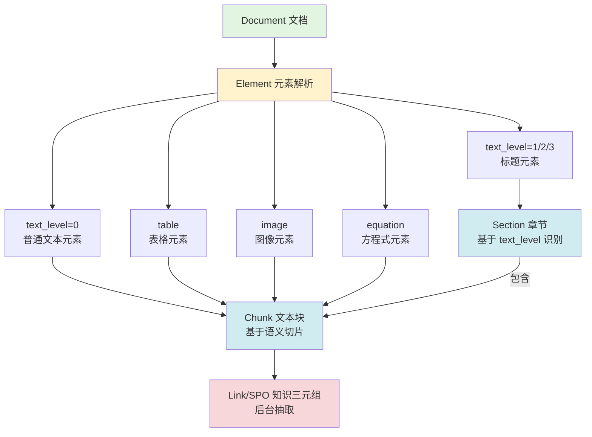
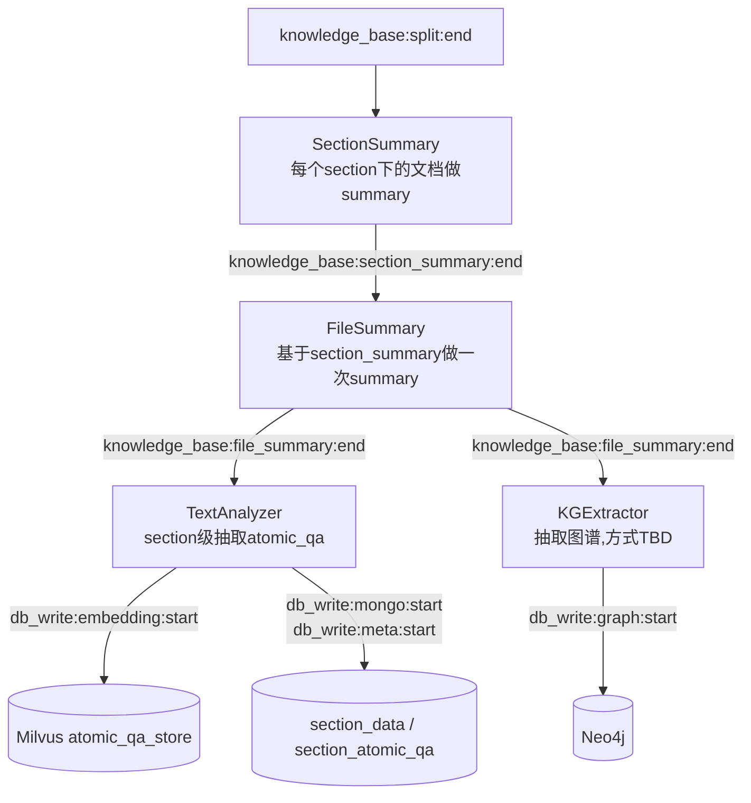

# 通用文件高级语义索引召回设计

## 版本信息

- **版本号**: v1.1
- **创建日期**: 2026-01-27
- **最后更新**: 2026-07-02
- **设计目标**: 针对整体索引流程中的高级语义功能进行细节设计

### 变更说明（v1.1）

> 配合《通用文件索引高性能架构设计》v1.1 的抽取链路重构，本次仅更新设计文档，不涉及代码改造。

1. **后台摘要链路改为两级**：新增 section 级摘要（`SectionSummaryWorker`），`FileSummaryWorker` 改为基于 section 摘要汇总生成 file 摘要。
2. **移除图像理解**：后台不再包含图像理解与 Embedding 环节，image chunk 不再生成文字描述与向量。
3. **后台抽取并行化**：file 摘要之后只保留 `TextAnalyzerWorker`（atomic_qa 抽取）与 `KGExtractorWorker`（图谱，抽取方式待定义）两条并行支路。TextAnalyzer 改为 **section 级抽取 + chunk_map 溯源**，QA 存储归属 `section_data`；移除 chunk summary，仅抽取 atomic_qa。
4. **前台 image chunk 向量化调整**：由于图像理解移除，image chunk 不再进入向量化链路（详见「基础 Embedding 策略」中的说明）。

## 概述

本文档是对通用文件索引pipeline中高级语义索引和召回功能的详细设计，涵盖向量生成、存储、检索和召回等核心模块。

## 前台阶段

### 文档解析

#### 概述

文档解析是索引流程的第一步，负责将各种格式的文档转换为结构化的元素数据。解析后的数据将统一存储到关系型数据库（MySQL）和文档数据库（MongoDB）中，为后续的切片、语义分析和检索提供基础。

#### PDF 文档解析

**解析框架**: 使用 **MinerU2.0** 框架进行 PDF 文档解析。

**解析输出格式**:

MinerU 将 PDF 页面上的所有元素进行分类识别，返回如下结构化数据：

```json
{
    "status": "success",
    "document_id": "唯一文档标识",
    "pages": 94,
    "metadata": {
        "source_name": "文件名.pdf",
        "source_type": "pdf",
        "source_url": "文件来源URL"
    },
    "struct_content": {
        "root": [
            {
                "page_idx": 0,
                "page_size": {"width": 595.0, "height": 842.0},
                "page_info": [
                    {
                        "type": "text",
                        "text": "文本内容",
                        "text_level": 1,
                        "page_idx": 0,
                        "id": "元素唯一标识",
                        "bbox": [x1, y1, x2, y2],
                        "element_index": 0
                    },
                    {
                        "type": "table",
                        "img_path": "表格图片路径",
                        "table_caption": ["表格标题"],
                        "table_footnote": ["表格脚注"],
                        "table_body": "<html>表格HTML内容</html>",
                        "page_idx": 0,
                        "id": "元素唯一标识",
                        "bbox": [x1, y1, x2, y2],
                        "element_index": 1
                    }
                ]
            }
        ]
    }
}
```

**元素类型**: 
- `text`: 文本段落（包含 `text_level` 标识标题层级）
- `table`: 表格（包含表格标题、内容和脚注）
- `image`: 图像（包含图片路径和描述）
- `equation`: 方程式（LaTeX 格式）

**元素信息字段**:
- `id`: 元素全局唯一标识（UUID）
- `type`: 元素类型
- `page_idx`: 所在页码
- `element_index`: 页面内元素索引
- `bbox`: 边界框坐标 [x1, y1, x2, y2]
- `text_level`: 文本层级（仅文本类型，1表示一级标题）

**图片元素示例**:

```json
{
    "type": "image",
    "img_path": "images/60c77566decc36dccc74f4f63fce5180f91ddcd60e78f3ff88098af6ee1505e1.jpg",
    "image_caption": [
        "Fig.6.The architecture of proposed knowledge distillation method."
    ],
    "image_footnote": [],
    "bbox": [119, 66, 470, 327],
    "page_idx": 5,
    "id": "6fd5d921-07ba-482f-abb0-ee8dbbbd2f8c",
    "image_base64": "/9j/4AAQSkZJRgABAQAAAQABAAD/...(base64编码)",
    "element_index": 0
}
```

**方程式元素示例**:

```json
{
    "type": "equation",
    "img_path": "images/0a7ebb9a886bd9665b33df5e12e260bd44ff14194aadaaa03c3156ae9881bcd2.jpg",
    "text": "$$\nL _ { c e } = - \\sum _ { i = 1 } ^ { c } y _ { i } \\log ( q _ { i } )\n$$",
    "text_format": "latex",
    "bbox": [305, 584, 376, 610],
    "page_idx": 5,
    "id": "f1f73cb7-43d4-4d15-b2ee-95cd0d97b5d7",
    "element_index": 10
}
```

**特殊字段说明**:
- **图片元素**:
  - `img_path`: 图片文件相对路径
  - `image_caption`: 图片标题列表
  - `image_footnote`: 图片脚注列表
  - `image_base64`: 图片的base64编码（可选，用于快速预览）

- **方程式元素**:
  - `img_path`: 方程式渲染图片路径
  - `text`: LaTeX格式的方程式文本
  - `text_format`: 文本格式类型（latex）

#### 其他文档格式解析

**统一抽象模型**: 所有文档格式遵循 **"段落标题 + 段落元素"** 的概念模型。

| 文档格式 | 段落标题 | 段落元素 |
|---------|---------|---------|
| PDF | 章节标题（text_level=1/2/3） | 文本、表格、图像、公式 |
| Excel | 工作表名称（Sheet Name） | 单元格、图表、表格区域 |
| Word | 标题样式（Heading 1/2/3） | 段落、表格、图像 |
| Markdown | 标题标记（#/##/###） | 段落、代码块、列表 |
| PPT | 幻灯片标题 | 文本框、图像、图表 |

**示例 - Excel 解析映射**:
```
工作表 "销售数据" (段落标题)
  ├─ A1:E10 表格区域 (段落元素)
  ├─ 图表1 (段落元素)
  └─ 备注文本框 (段落元素)

工作表 "财务报表" (段落标题)
  └─ ...
```

#### 数据存储策略

**双数据库存储设计**:

1. **MySQL (`element_meta_info`)** - 存储元素元数据和关系信息
   - 字段: `element_id`, `page_index`,`element_type`, `page_position`, `text_level`, `bucket_name`, `image_file_path`, `image_file_name`, `image_file_type`, `image_file_format`, `image_file_suffix`, `created_at`
   - 用途: 快速查询元素关系、位置信息、过滤和排序

2. **MongoDB (`element_data`)** - 存储元素完整内容
   - 字段: `_id`, `type`, `content`
   - 用途: 存储大文本内容、表格HTML、图片路径等非结构化数据

**存储示例**:

```sql
-- MySQL element_info
INSERT INTO element_info (
    element_id, document_id, type, page_idx, 
    element_index, bbox, text_level
) VALUES (
    'uuid-123', 'doc-456', 'text', 0, 
    0, '[94,124,528,161]', 1
);
```

```javascript
// MongoDB element_data
db.element_data.insertOne({
    element_id: "uuid-123",
    document_id: "doc-456",
    content: {
        text: "Arm Cortex-M0+ 32-bit MCU...",
        raw_html: null
    },
    metadata: {
        source_file: "stm32g030c6.pdf",
        parse_time: "2026-01-27T10:00:00Z"
    }
});
```

#### 后续用途

解析后的元素数据主要用于以下场景：

1. **文档切片**: 基于元素边界和层级关系进行智能切片
2. **简单翻译**: 保留元素级别的原始结构，逐元素进行翻译后重组
3. **关系构建**: 基于元素位置和层级构建文档结构树
4. **精确定位**: 检索时可精确定位到元素级别，返回元素在文档中的准确位置

### 文档切片

#### 切片策略

#### 基础粒度关系构建

文档的知识体系是一个多层级的粒度结构，从最粗粒度的文档到最细粒度的知识三元组，形成了一个完整的知识网络。这种层级关系为后续的检索、召回和知识推理提供了基础。

**粒度层级架构**：

```
Document (文档层 - 最大粒度)
    ├─ Element (元素层 - 解析基础单位)
    │   ├─ Section (章节层 - Element演化)
    │   │   └─ Chunk (块层 - Element演化)
    │   │       └─ Link/SPO (知识层 - Chunk抽取)
    │   │           ├─ Node (节点)
    │   │           └─ Relation (关系)
```

**从属关系**：
- Document > Element：文档包含所有解析出的元素
- Element → Section：通过 text_level 等信息识别章节边界
- Element → Chunk：通过语义切片聚合元素
- Document > Section：文档包含所有章节
- Section > Chunk：一个章节包含多个块（从属关系）
- Chunk > Link：一个块可以抽取出多个知识三元组（从属关系）

##### 1. 最大粒度：Document（文档层）

**核心标识**: `document_id`

**作用**:
- 文档是所有知识的根节点
- 提供全局上下文和元信息
- 支持文档级别的检索和过滤

**存储位置**:
- MySQL: `document_meta_info` 表
- MongoDB: `document_data` 集合

##### 2. 基础单位：Element（元素层）

Element 是文档解析的直接输出，是所有上层结构的演化基础。

**核心标识**: `element_id`

**来源**: 文档解析（MinerU2.0）直接输出

**元素类型**:
- text: 文本段落（包含 text_level）
- table: 表格
- image: 图像
- equation: 方程式

**存储位置**:
- MySQL: `element_meta_info` 表
- MongoDB: `element_data` 集合

##### 3. 中间层：Section 和 Chunk（从 Element 演化）

**Section（章节层）**:

Section 是从 Element 演化而来的章节粒度单位，基于文档的逻辑结构划分。

**核心标识**: `section_id`

**演化规则**:
- 识别具有 `text_level=1/2/3` 的标题 Element
- 从标题 Element 开始，到下一个同级或更高级标题之前的所有 Element 构成一个 Section

**存储位置**:
- MySQL: `section_meta_info` 表
- MongoDB: `section_data` 集合（存储聚合后的章节内容）

**Chunk（块层）**:

Chunk 是从 Element 演化而来的基本检索单位，基于语义边界进行切片。

**核心标识**: `chunk_id`

**演化规则**:
- 基于语义边界将多个 Element 聚合为一个 Chunk
- 通常包含 500-1000 token
- 一个 Chunk 可以包含多个 Element
- 一个 Element 可能被拆分到多个 Chunk（如长文本）
- Chunk 属于某个 Section（通过 section_id 关联）

**存储位置**:
- MySQL: `chunk_meta_info` 表
- MongoDB: `chunk_data` 集合

**从属关系**:

Section > Chunk：一个 Section 包含多个 Chunk

```sql
-- Section 包含 Chunk 的映射
SELECT c.chunk_id, c.section_id, s.section_title
FROM chunk_meta_info c
JOIN section_meta_info s ON c.section_id = s.section_id
WHERE c.document_id = 'doc-123';
```

**关系映射表**:

为了维护层级关系，使用关系表：

- `section_document`: Section 与 Document 的关系
- `chunk_section_document`: Chunk 与 Section 和 Document 的关系

##### 4. 最底层：Link/SPO（知识层 - 从 Chunk 抽取）

**核心概念**: SPO（Subject-Predicate-Object）三元组是知识图谱的基本单位，也称为 Link。

**表现形式**: Node（节点） + Link（关系）

- **Node**: 表示实体（Subject 或 Object）
- **Link**: 表示关系（Predicate），连接两个 Node，即 SPO 三元组

**来源**: 从 Chunk 文本中抽取（后台阶段）

**从属关系**: Chunk > Link

一个 Chunk 可以抽取出多个 Link/SPO 三元组：

```
Chunk: "YOLO算法是一种实时目标检测算法，广泛应用于计算机视觉领域。"
  └─ Link1: (YOLO, 是, 目标检测算法)
  └─ Link2: (YOLO, 具有特性, 实时)
  └─ Link3: (YOLO, 应用于, 计算机视觉)
  └─ Link4: (目标检测算法, 属于, 计算机视觉)
```

**与上层关联**:

Link 通过 `chunk_id` 关联到 Chunk 层，从而可以追溯到完整的文档层级：

```
Link → Chunk → Section → Document
```

**存储位置**:
- Neo4j: 图数据库存储 Node 和 Link
- MySQL: 存储 SPO 元信息和与 Chunk 的关联关系
- Milvus: 存储 SPO 的向量表示

**关键结构**:

```json
{
    "spo_id": "uuid",
    "subject": {
        "id": "node-123",
        "name": "深度学习",
        "type": "Concept"
    },
    "predicate": "应用于",
    "object": {
        "id": "node-456",
        "name": "计算机视觉",
        "type": "Field"
    },
    "chunk_id": "uuid",  // 关联到 Chunk
    "document_id": "uuid",
    "confidence": 0.95
}
```

**抽取时机**:

SPO 三元组的抽取在**后台阶段**进行，不影响前台的基础检索功能。

**抽取流程**:

1. **实体识别**: 从 Chunk 文本中识别实体（Node）
2. **关系抽取**: 识别实体之间的关系（Link）
3. **三元组构建**: 构建完整的 SPO 三元组
4. **关联映射**: 将 SPO 与 `chunk_id` 关联
5. **图谱入库**: 
   - Neo4j 存储图结构
   - MySQL 存储元信息
   - Milvus 存储向量表示

**知识网络构建**:

通过 `chunk_id` 的关联，Link/SPO 可以向上追溯完整路径：

```
Link (知识三元组)
  ↓ (通过 chunk_id)
Chunk (文本块)
  ↓ (通过 section_id)
Section (章节)
  ↓ (通过 document_id)
Document (文档)
```

这种向上追溯能力使得：
1. **知识定位**: 可以精确定位知识来源的文档、章节和具体位置
2. **上下文理解**: 检索知识时可以提供完整的文档上下文
3. **关系推理**: 基于文档结构进行知识关联和推理

**示例场景**:

```
Document: "深度学习在计算机视觉中的应用"
  ├─ Element[0]: type=text, text_level=1, text="第2章 目标检测"
  ├─ Element[1]: type=text, text_level=0, text="YOLO算法是一种实时目标检测算法..."
  ├─ Element[2]: type=image, img_path="yolo_architecture.jpg"
  │
  ├─ Section[2]: "第2章 目标检测" (从 Element[0] 识别)
  │   ├─ Chunk[2-1]: Element[0,1] 的内容 (500 tokens)
  │   │   └─ Link: (YOLO, 是, 目标检测算法)
  │   │   └─ Link: (YOLO, 具有特性, 实时)
  │   │   └─ Link: (目标检测算法, 属于, 计算机视觉)
  │   │
  │   └─ Chunk[2-2]: Element[2] 图像内容 (image chunk)
  │       └─ Link: (YOLO架构, 包含, 特征提取层)
```

##### 粒度关系总结

| 粒度层级 | 标识符 | 主要用途 | 演化来源 | 从属关系 | 处理阶段 |
|---------|-------|---------|---------|---------|---------|
| Document | document_id | 文档级别检索、全局上下文 | 原始文档 | 最大粒度 | 文档加载 |
| Element | element_id | 解析基础单元、精确定位 | 文档解析 | Document > Element | 文档解析 |
| Section | section_id | 章节级别检索、逻辑分块 | Element 演化 | Section > Chunk | 文档切片 |
| Chunk | chunk_id | 基础检索单元、向量化对象 | Element 演化 | Chunk > Link | 文档切片 |
| Link/SPO | link_id/spo_id | 知识推理、关系检索 | Chunk 抽取 | 最小粒度 | 后台抽取 |

**演化路径**:

```
Document (加载)
    ↓
Element (解析)
    ↓ ↓
Section ← Element → Chunk (切片)
    ↓
  Link/SPO (抽取)
```

**从属关系链**:

```
Document > Element
Element → Section (通过 text_level 识别)
Element → Chunk (通过语义切片)
Section > Chunk (一个 Section 包含多个 Chunk)
Chunk > Link (一个 Chunk 抽取多个 Link)
```

**检索时的多粒度利用**:

1. **粗粒度过滤**: 先用 Document 和 Section 级别进行初筛
2. **细粒度召回**: 在 Chunk 级别进行向量检索
3. **精确定位**: 返回 Element 级别的准确位置
4. **知识关联**: 通过 Link/SPO 提供相关知识和推理路径

**向上追溯能力**:

Link 可以通过 `chunk_id` 向上追溯完整路径：
```
Link (知识) → Chunk (块) → Section (章节) → Document (文档)
```

这种追溯能力使得知识检索时可以提供完整的上下文信息。

##### 完整层级关系总览



**关键说明**:

1. **Element 是基础**: 所有上层结构都从 Element 演化而来
2. **Section 的识别**: 通过 `text_level` 字段识别章节边界
3. **Chunk 的生成**: 基于语义边界聚合多个 Element
4. **从属关系**: Section > Chunk > Link（逐级包含）
5. **处理阶段**: 
   - 前台：Document → Element → Section/Chunk
   - 后台：Chunk → Link/SPO

#### 基础 Embedding 策略

为了支持不同粒度和场景的语义检索，我们设计了三种基础 Embedding 策略，每种策略针对不同的召回场景和精度需求。

##### 1. Chunk Embedding（基础块向量）

**定义**：对单个 Chunk 的原始内容进行向量化，不添加任何额外上下文信息。根据 Chunk 的类型（text、image、table、equation），采用不同的向量化策略。

**Chunk 与 Element 的关系**：

- **一个 Chunk 可以包含半个、一个、多个 Element**
- **Text Chunk**: 通常由多个连续的 text 类型 Element 组成
- **Image Chunk**: 通常对应单个 image 类型 Element
- **Table Chunk**: 通常对应单个 table 类型 Element  
- **Equation Chunk**: 通常对应单个 equation 类型 Element

**生成方式**：

* 文本Chunk:【文本内容】
* 表格Chunk：【表格标题 + "\n" + 表格内容 + "\n" + 表格脚注】
* 方程式Chunk：【公式：+ "$$" + "\n" + 方程式内容（latex） + "\n" + "$$"】

> ⚠️ **图像Chunk 向量化已移除（v1.1）**：原设计中图像Chunk 通过「图片标题 + 图片理解内容（LLM） + 图片脚注」生成向量，依赖后台 `ImageUnderstandWorker`。本次重构移除图像理解后，**image chunk 不再进入向量化链路**，`chunk_store` 中不再包含 type=image 的向量记录。图片元素仍由解析阶段保留（element_meta_info / element_data），可在需要时回溯定位，但不参与语义检索召回。后续如需恢复多模态检索，可作为独立增强项重新引入。

**存储位置**：

- **Milvus Collection**: `chunk_store`


**适用场景**：

1. **精确匹配检索**: 用户查询与 Chunk 内容直接相关
2. **快速召回**: 不需要额外上下文信息的场景
3. **多类型检索**: 支持文本、表格、公式的统一检索（图像自 v1.1 起不参与向量化）

**优点**：
- ✅ 向量表示纯粹，不受外部信息干扰
- ✅ 检索结果精确，直接定位到具体内容
- ✅ 支持多种内容类型（文本、表格、公式）
- ✅ 适合问答场景（QA）

**缺点**：
- ❌ 缺乏上下文信息，可能导致语义理解不完整
- ❌ 对于需要理解章节背景的查询效果较差

##### 2. Section Embedding（章节标题向量）

**定义**：对 Section（章节）的标题进行向量化。

**文本内容示例**：

```text
第2章 目标检测算法
```

**存储位置**：

- **Milvus Collection**: `section_store`

**适用场景**：

1. **主题检索**: 查询涉及某个完整主题或章节
2. **概览召回**: 需要理解整体内容而非具体细节
3. **多文档对比**: 比较不同文档中相似主题的章节

**优点**：
- ✅ 提供完整的章节级语义理解
- ✅ 适合主题性查询和概览类问题
- ✅ 可以召回整个相关章节

**缺点**：
- ❌ 粒度较粗，可能无法精确定位具体知识点
- ❌ 对长章节可能存在信息压缩损失


##### 3. Enhanced Chunk Embedding（增强块向量）

**定义**：将 Section 上下文与 Chunk 内容结合生成向量，为每个 Chunk 提供章节级的背景信息。

**核心思想**：

Enhanced Chunk Embedding = Section Context + Chunk Content

通过在 Chunk 文本前添加所属 Section 的标题和摘要信息，使得每个 Chunk 的向量都包含章节背景，提升语义理解能力。

**文本内容示例**：

```text
第2章 目标检测算法

YOLO算法是一种实时目标检测算法，广泛应用于计算机视觉领域。
该算法采用单阶段检测框架，将目标检测问题转换为回归问题，
能够在保持高精度的同时实现实时处理。
```

**存储位置**：

- **Milvus Collection**: `enhanced_chunk_embeddings`

**适用场景**：

1. **上下文感知检索**: 查询需要理解 Chunk 所处的章节背景
2. **跨章节对比**: 比较不同章节中相似内容的语义差异
3. **主题关联召回**: 通过章节信息关联相关的 Chunk

**优点**：
- ✅ 结合了 Chunk 的精确性和 Section 的上下文信息
- ✅ 提升了语义理解的准确性
- ✅ 适合需要背景信息的复杂查询

**缺点**：
- ❌ 向量生成成本较高（每个 Chunk 都需要添加 Section 信息）
- ❌ 存储空间需求增加（需要单独的 Collection）

**与 Chunk Embedding 的对比**：

| 维度 | Chunk Embedding | Enhanced Chunk Embedding |
|------|----------------|-------------------------|
| 文本内容 | 仅 Chunk 原始文本 | Section 上下文 + Chunk 文本 |
| 语义理解 | 局部精确 | 全局上下文感知 |
| 检索精度 | 高（精确匹配） | 中等（上下文增强） |
| 适用场景 | 问答、精确定位 | 主题检索、关联召回 |
| 存储成本 | 低 | 中等 |

##### 三种 Embedding 的协同使用

* **句子窗口检索**：

为了在获取最相关的单个chunk后更好地推理所找到的上下文，我们通过在检索到的句子前后各扩展k个句子来扩展上下文窗口，然后将这个扩展的上下文发送给LLM。

**这就需要知道chunk和section的关系，将所有的属于同一个section的chunk一起召回，数量可以根据参数来制定。**

* **topic检索**：

**根据section的embedding进行召回，并召回对应的子chunk，数量可以根据参数来制定。**

* **enhanced chunk检索**：

**根据enhanced chunk的embedding进行召回，因为包含了section的文本语义，更易于召回。**


**存储和检索架构**：

```
Milvus 向量数据库
├─ chunk_embeddings (Collection 1)
│   ├─ 基础 Chunk 向量
│   └─ 用于精确检索
│
├─ section_embeddings (Collection 2)
│   ├─ 章节级向量
│   └─ 用于主题检索
│
└─ enhanced_chunk_embeddings (Collection 3)
    ├─ 增强 Chunk 向量
    └─ 用于上下文感知检索
```

**向量生成时机**：

所有三种 Embedding 都在**前台阶段**生成，作为基础索引流程的一部分：

```
文档解析 → 切片 → 向量生成 → 存储
                    ├─ Chunk Embedding
                    ├─ Section Embedding
                    └─ Enhanced Chunk Embedding
```


## 后台阶段

后台阶段在 `TextSplitter` 完成（`knowledge_base:split:end`）之后启动，采用 **自底向上的两级摘要 + 后续并行抽取** 结构，所有后台任务不影响前台 100% 进度。



### Section 摘要生成

**职责组件**: `SectionSummaryWorker`

**触发事件**: `knowledge_base:split:end`

**处理逻辑**:

1. 按 `section_id` 聚合该 section 下的所有 chunk 内容（文本/表格/公式，不含图像描述）。
2. 对每个 section 调用 LLM 生成 section 级摘要（多个 section 可并发处理）。
3. 产出：
   - 摘要元数据 → `db_write:meta:start`（MySQL `section_summary_meta_info`）
   - 摘要内容 → `db_write:mongo:start`（MongoDB `section_summary_data`）
   - 摘要向量 → `db_write:embedding:start`（Milvus `section_summary_store`）
4. 发送 `knowledge_base:section_summary:end` 事件，触发 `FileSummaryWorker`。

**设计要点**:

- 以 section 为粒度做摘要，避免一次性对全文档做摘要时的上下文丢失与超长输入。
- section 摘要向量可用于 section 级语义检索，补足「Section Embedding（仅标题向量）」在内容表达上的不足。

### File 摘要生成

**职责组件**: `FileSummaryWorker`

**触发事件**: `knowledge_base.section_summary.end`

**处理逻辑**:

1. 从 `SectionSummaryEndMessage` 的自包含 `section_summaries_payload` 字段读取所有 section 摘要正文（**不读数据库**，与 SectionSummary 同样消除写库竞态；payload 含 `section_id / summary_id / title / summary_text / is_leaf / parent_section_id / chunk_count / language`）。
2. 调用 `FileSummaryService` → `FileSummarizer` 对 section 摘要做一次 LLM 汇总，产出：
   - `summary_text`：文件级摘要正文（3-6 句）
   - `keywords: List[str]`：关键词列表
   - `topics: List[str]`：主题标签
   - `document_type: Optional[str]`：文档类型分类（如 `technical / research_paper / tutorial / blog / manual`）
3. 产出分发（三路异步写入）：
   - 摘要元数据 → `db_write.meta.start`（MySQL `document_summary` 表：`document_id ↔ summary_id` 关联）
   - 摘要内容 → `db_write.mongo.start`（MongoDB `document_data.summary` 结构化子文档，含 `summary_id / text / keywords / topics / document_type / section_count / chunk_count / language`）
   - 摘要向量 → `db_write.embedding.start`（Milvus `file_summary_store`，`role=document_summary`）
4. 发送 `knowledge_base.file_summary.end` 事件（`SummaryEndMessage`），触发下游 `TextAnalyzerWorker` 与 `KGExtractorWorker`。

> ⚠️ **下游接通状态**：`KGExtractorWorker` 与 `TextAnalyzerWorker` 尚未实现，当前 `FileSummaryWorker` 发送 `SummaryEndMessage` 后，下游消费链路暂以注释形式保留，待后续两个 Worker 落地后取消注释接通。`FileSummary` 自身的摘要生成与三路落库不受影响，可独立运行。

**代码分层**（与 SectionSummary 对齐）：

```
src/index/common_file_extract/extract/
├── file_summary_context.py      # payload → section 摘要列表（纯函数）
├── file_summary_summarizer.py   # LLM 汇总 + 重试封装
└── __init__.py

src/service/knowledge/components/
└── file_summary_service.py      # 编排层（配置加载 + LLM client + 主编排）

src/types/models/
└── file_summary_result.py       # FileSummaryItem / FileSummaryResult DTO

src/prompts/background/
└── file_summary.py              # build_file_summary_messages()
```

**设计要点**:

- **自底向上汇总**：file_summary 自然汇聚各 section 要点，质量与层次优于一次性全文档摘要。
- **不读库**：输入完全来自 `SectionSummaryEndMessage` 消息体，消除 section_summary 写库异步竞态。
- **file_summary 作为后续 QA 抽取与 KG 抽取的全局上下文**（主题锚点）。
- **keywords / topics / document_type 的用途**：
  - `keywords`：前端文档卡片展示、知识库全局关键词聚合检索、检索路由规划器（RoutePlanner）的 query 改写参考。
  - `topics`：知识库主题分面导航（faceted navigation）、跨文档主题聚合、`section_summary_dense` / `file_summary_dense` 检索路由的触发启发。
  - `document_type`：文档分类展示、按类型过滤检索、不同类型文档的差异化处理策略（如 `research_paper` 触发 abstract 优先召回、`tutorial` 触发步骤型 chunk 优先）。
- **MongoDB 存储升级**：`document_data` 新增 `summary: Optional[Dict]` 结构化子文档（与 `section_data.summary` 风格对齐）；旧字段 `summary_zh` / `summary_en` 标记 deprecated（保留不删，向后兼容）。

### 文本分析（QA抽取）

**职责组件**: `TextAnalyzerWorker`

**触发事件**: `knowledge_base:file_summary:end`（与 `KGExtractorWorker` 并行）

#### 抽取粒度：section 级抽取 + chunk 级溯源

QA 抽取在 **section 级**进行（一次 LLM 调用处理一个 section 的全部 chunk），但每条 QA 通过 `chunk_map` 机制**精确溯源到所属 chunk**，兼顾「section 主题视野」与「chunk 定位精度」。

**chunk_map 溯源机制**:

1. **抽取前**：为 section 下每个 chunk 分配代号（如 `〔C1〕`、`〔C2〕`），建立 `chunk_map = {C1: real_chunk_id_1, C2: real_chunk_id_2, ...}`。
2. **喂给 LLM 的 section 正文**：按 chunk 顺序拼接，每个 chunk 前缀其代号：
   ```
   〔C1〕chunk1 文本
   〔C2〕chunk2 文本
   〔C3〕chunk3 文本
   ```
   LLM 只看到代号，不接触真实 chunk_id（省 token、不泄露 UUID、引用更干净）。
3. **LLM 输出**：每对 QA 携带 `source_chunk_codes`（如 `[C1, C2]`），表示答案来源 chunk。
4. **抽取后**：用 `chunk_map` 将 `source_chunk_codes` 替换为真实 `chunk_id`，写入 QA 的 `source_chunk_ids` 字段。

#### 抽取输入（DB + Message 混合取数）

TextAnalyzer 的输入来自两个来源，按「数据是否已稳定落盘」区分，避免 Kafka 异步写库竞态：

| 输入项 | 来源 | 理由 |
|--------|------|------|
| section 正文 + chunk 列表 | **读 DB**（Mongo `section_data` + `chunk_data` by `document_id`） | split → section_summary → file_summary 串行链路，到 file_summary.end 触发时，section/chunk 早已稳定入库，无竞态 |
| `file_summary`（全局主题锚点） | **读 Message**（`SummaryEndMessage.file_summary`） | file_summary 刚由 FileSummaryWorker 发出，其自身落库走 `db_write.mongo` 异步 Consumer，消费进度不保证先于本 Worker，故从消息体直取，不读库 |

```
section 标题（来自 section_data.text）
+ section 正文全文（chunk_data.search_text 按序拼接，每个 chunk 前缀代号 〔Cn〕）
+ file_summary（来自 SummaryEndMessage 消息体，全局主题锚点）
```

> section_summary 在 section 级抽取中冗余（section 全文已给出），不喂；`file_summary` 提供全局主题锚点，约束 QA 与文档主题对齐。
>
> **与上游分层模式差异**：SectionSummary / FileSummary 坚持「自包含不读库」（因为其上游写库竞态真实存在）；TextAnalyzer 是链路末端，上游数据已落盘，故采用混合取数——这是有意的边界突破，不是模式回归。

#### 分批抽取（超长 section 处理）

当 section 下 chunk 过多、拼接全文超出 LLM 上下文预算时，按 **N chunk / 批** 滑窗分批抽取：

1. **N 的确定**：N 由现有分块策略参数推导（基于 `chunk_size` / LLM 上下文窗口预算），保证单批拼接全文 token 量落在安全区间。N 作为 `text_analyzer` 组件配置项可调。
2. **每批独立 chunk_map**：每批内 chunk 重新编号 `〔C1〕…〔Cn〕`，建立本批 `chunk_map`，代号在批内唯一即可（批间互不影响）。
3. **每批独立 LLM 调用**：每批各跑一次 QA 抽取，输入仍带 `file_summary` 主题锚点。
4. **批间合并去重**：所有批次的 QA 汇总后做语义去重（question 相似度高的保留 relevance 最高的一条），再按 section 整体数量上限截断。
5. **溯源不受影响**：每条 QA 的 `source_chunk_codes` 经本批 `chunk_map` 替换为真实 `chunk_id`，跨批 QA 的 `source_chunk_ids` 仍精确到具体 chunk。

> 分批的代价是丢失「一次看全 section」的全局视野，但通过 `file_summary` 主题锚点 + 批间语义去重兜底，可接受。短 section（chunk 数 ≤ N）退化为单批，等价于原方案。

#### QA 数量控制

按 section 正文规模浮动，**典型 3~5 对/section，硬区间 2~8**：

| section 规模 | 正文 token 量 | 建议 QA 数 |
|------------|-------------|----------|
| 短（1~2 chunk） | 500~1000 | 2~3 |
| 中（3~6 chunk） | 1500~4000 | 3~5 |
| 长（>6 chunk，分批） | >4000 | 5~8（封顶 8，按 section 整体计，非每批） |

参考换算：`QA 数 ≈ clamp(section正文token数 / 450, 2, 8)`（分批场景按 section 全文 token 总量计，非单批）。prompt 明确「宁缺毋滥、不凑数、最大化多样性、禁止语义重复」——数量上限是压制琐碎问题最便宜且最有效的手段。

#### 抽取质量控制

抑制「琐碎/跑题/指代依赖」问题，多层兜底：

1. **全局主题锚点**：抽取输入带 `file_summary`，约束「只抽与文档主题相关的问题」。
2. **prompt 约束**：
   - 问题类型白名单：事实型 / 定义型 / 因果型 / 对比型 / 操作型，排除「字面细节型」；
   - 自包含性：问题离开 section 也能看懂，不依赖指代词/上下文；
   - 数量上限 + 多样性 + 禁重复。
3. **LLM 自评 relevance**：每对 QA 输出相关度分，低于阈值丢弃。
4. **廉价后过滤（无二次 LLM 调用）**：`question 向量` 与 `file_summary 向量` 相似度过低则丢弃。
5. **可选增强（未来）**：索引时传 `extraction_focus`（如「关注价格、规格、交付期」）显式引导抽取方向，暂不实现。

> **设计闭环**：`file_summary` 在此处的价值，反过来证明了「SectionSummary → FileSummary → TextAnalyzer」链路顺序的合理性——若没有 file_summary 作为主题锚点，section 级 QA 抽取会退化成无主题的局部生成，琐碎问题不可控。

#### QA 存储方案

> QA 在 section 级抽取、且可横跨多 chunk，因此**存储归属为 `section_data`**（非 chunk_data）。chunk 级溯源由 QA 内部 `source_chunk_ids` 承担，不依赖存储位置。

**MySQL（极简关系表，仅关系/聚合/级联删除用）**：

```sql
-- section_atomic_qa
qa_id        VARCHAR(36) PRIMARY KEY
section_id   VARCHAR(36) NOT NULL   -- idx
document_id  VARCHAR(36) NOT NULL   -- idx
created_at   DATETIME
INDEX idx_section_id (section_id)
INDEX idx_document_id (document_id)
```

不存 `user_id` / `file_id` / `language` / `qa_type` / `source_chunk_ids`（数组放 Mongo）。

**MongoDB（写入已有 `section_data`，新增 `atomic_qa` 字段，每个 QA 为一个完整 JSON）**：

```js
// section_data 文档新增
{
  ...原有 section 字段...,
  "atomic_qa": [
    {
      "qa_id": "...",
      "question": "...",
      "answer": "...",
      "source_chunk_ids": ["chunk_id_1", "chunk_id_2"],  // chunk_map 替换后的真实 id，可多个
      "relevance": 0.92,                                   // LLM 自评，可选
      "created_at": "..."
    }
  ]
}
```

**Milvus（单库 `atomic_qa_store`，不分中英）**：

```
pk     : qa_id
vector : question 的 dense embedding（qwen3-embedding-0.6b, 1024 维）
scalar : qa_id, section_id, document_id
```

- 仅对 `question` 建向量（方案 A：query 与 question 同空间，召回精度最高）；
- **不加稀疏向量**，dense only；
- 无 `language` 字段、不分 zh/en 库。

#### QA 召回衔接（集成进多路召回知识库检索工具）

QA 召回作为多路召回（`ParallelRecall`）的一条语义路由（`qa_dense`），与 `chunk_dense` / `enhanced_chunk_dense` / `section_summary_dense` / `file_summary_dense` 等路由并行执行，结果汇入统一候选池。在此基础上叠加「直答短路」：

**取数路径**（遵循「Milvus 返回 id → Mongo 取数」原则，id 粒度为 section_id）：

```
query → Milvus atomic_qa_store ANN（query 向量 vs question 向量）
命中 [qa_id, section_id, document_id, score]
  → Mongo section_data by section_id（批量，一次取多个 section）
  → 在 atomic_qa 数组中按 qa_id 定位
  → 取 question / answer / source_chunk_ids
  → QAItem 填充 question/answer/source_chunk_ids/section_id
```

> chunk 级溯源不靠 Milvus 直接给 chunk_id，而靠 QA json 里的 `source_chunk_ids`——与 chunk_map 溯源设计完全吻合。Milvus `atomic_qa_store` 的 scalar 必须含 `section_id`（v1.1 落地补齐），否则无法跳到 Mongo。

**召回位置（A+B 混合：带直答短路的多路分支，集成进多路召回工具）**：

1. `qa_dense` 路由与其他语义/词法路由并行跑 QA 召回（query 向量 vs question 向量），返回 `QAItem` 列表。
2. **直答短路**：若 `qa_dense` 的 top1 score ≥ θ_direct，直接返回该 QA 的 `answer` 作为答案（附来源 `source_chunk_ids`），跳过后续 rerank + 上下文组装。θ_direct 放检索配置，需实测校准。
3. **分支合并**：否则（无直答命中）把 QA 命中的 `source_chunk_ids` 解析为 `ChunkItem`，注入多路召回统一候选池，与 chunk_dense 等路候选一起参与 rerank + 上下文组装。
4. `QAItem → ChunkItem` 的转换在 `ParallelRecall` 统一扁平化处完成（`chunk_id=f"qa:{qa_id}"` 仅作候选池占位，真正 chunk 溯源由 `source_chunk_ids` 承担，rerank 后取原文时按 `source_chunk_ids` 去 `chunk_data` 取）。

这样既享受 FAQ 直答的低延迟，又不丢失 QA 对相关 chunk 的召回增益，且 QA 路径与既有多路召回工具完全融合，不另起独立召回链路。

#### 变更说明（v1.1）

- 原设计中 TextAnalyzer 依赖 `ImageUnderstandWorker` 的图片理解结果。移除图像理解后，TextAnalyzer 直接基于文本抽取，不再处理图片描述，链路更短、延迟更低。
- 原设计同时生成 chunk summary 与 atomic_qa，本次重构**移除 chunk summary**，TextAnalyzer 仅负责 atomic_qa 抽取。
- 抽取粒度由 chunk 级改为 **section 级**，并通过 **chunk_map** 保留 chunk 级溯源能力。
- QA 存储归属为 `section_data`（section 级抽取 + 多 chunk 溯源的最自洽选择）。v1.0 遗留的 `chunk_atomic_qa` 表 / ORM / Repo **彻底删除**（无生产数据，不加 drop 迁移脚本），统一改用 `section_atomic_qa`。
- **取数模式**：TextAnalyzer 输入采用「DB + Message 混合」——section/chunk 正文读 DB（file_summary.end 触发时已稳定入库），`file_summary` 读消息体（其自身落库异步、不保证先到）。这是链路末端对「自包含不读库」模式的有意突破。
- **超长 section**：按 N chunk/批分批抽取，N 由分块策略参数推导；每批独立 chunk_map + LLM 调用，批间语义去重 + section 整体数量上限截断。
- **Milvus schema**：`atomic_qa_store` scalar 补 `section_id`（QA→Mongo 取数路径必备）。其余 v1.0 遗留字段（`agent_ids`/`type`/`role`/`label_id` 等）本轮保留不动，后续统一治理 Milvus 字段去留时一并处理。
- **下游接通**：TextAnalyzer 完成后发送 `knowledge_base.analyze.end`，供 status manager 标记后台阶段完成（`IndexStage.ANALYZE_END` 已存在，补 topic 定义）。
- **检索侧集成**：QA 召回作为 `qa_dense` 路由接入 `ParallelRecall` 多路召回，与既有 chunk/summary 路由并行；直答短路（θ_direct）与 `source_chunk_ids` 注入候选池均在多路召回框架内实现，不另起独立召回链路。

### 知识/事理图谱抽取

**职责组件**: `KGExtractorWorker`

**触发事件**: `knowledge_base:file_summary:end`（与 `TextAnalyzerWorker` 并行）

**产出**:

- 三元组（实体/关系/事件）→ `db_write:graph:start` → Neo4j
- 图谱元信息 → MySQL
- 图谱向量（可选）→ Milvus `spo_store`
- 完成事件 → `knowledge_base:graph:end`

> ⚠️ **抽取方式待定义（v1.1）**：本版仅固定 `KGExtractorWorker` 在链路中的位置与上下游 Topic，**具体抽取策略暂未确定**，待后续补充设计，包括但不限于：
> - 抽取输入粒度：基于 chunk、基于 section_summary，还是两者结合；
> - 抽取范围：仅实体关系图谱，还是同时包含事理图谱（事件/因果/时序）；
> - 是否分批抽取、并发策略与 prompt/schema 设计；
> - 三元组去重、跨 chunk 实体合并与质量过滤策略。
