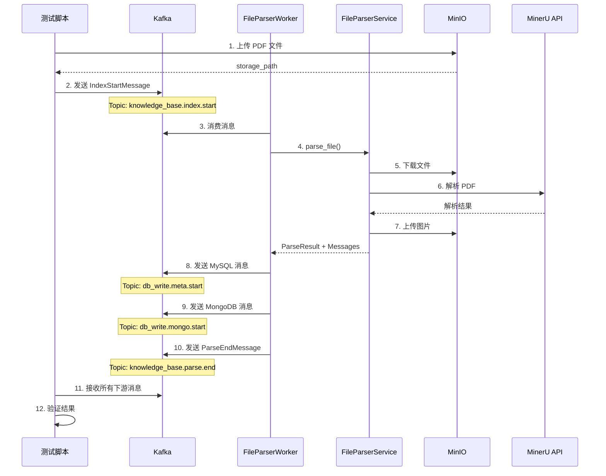

# Kafka Worker 端到端测试指南

## 📋 概述

本目录包含 FileParserWorker 的完整 Kafka 集成测试。

## 🎯 测试类型对比

### 1. Service 层测试 (不涉及 Kafka)
**文件**: `test/service/knowledge/components/test_file_parser_service_e2e.py`

**流程**:
```
测试脚本 → FileParserService → 验证结果
```

**优点**: 快速，不依赖 Kafka
**缺点**: 不测试消息流转

**运行**:
```bash
uv run python test/service/knowledge/components/test_file_parser_service_e2e.py
```

---

### 2. Kafka Worker 测试 (完整流程) ⭐
**文件**: `test/kafka/test_file_parser_worker_e2e.py`

**流程**:
```
测试脚本发送消息 → Kafka → FileParserWorker → FileParserService → 
→ Worker发送结果到Kafka → 测试脚本接收验证
```

**优点**: 测试完整消息链路
**缺点**: 需要启动 Worker 和 Kafka

---

## 🚀 如何运行 Kafka 完整测试

### 前置条件

1. **启动必要服务**:
   - ✅ Kafka: `192.168.201.14:9092`
   - ✅ MinIO: `192.168.201.14:9000`
   - ✅ MinerU: `http://192.168.201.14:18000`

2. **检查配置文件** (`config/config.toml`):
   ```toml
   [kafka]
   bootstrap_servers = ["192.168.201.14:9092"]
   
   [minio]
   endpoint = "192.168.201.14:9000"
   
   [mineru]
   api_url = "http://192.168.201.14:18000"
   ```

### 步骤 1: 启动 FileParserWorker

在**第一个终端**中运行：

```bash
# 方式 1: 使用启动脚本
uv run python scripts/start_file_parser_worker.py

# 方式 2: 直接运行 Worker
uv run python src/db/kafka/workers/file_parser_worker.py
```

**预期输出**:
```
================================================================================
启动 FileParser Worker
================================================================================
✓ Kafka Producer 启动成功
✓ FileParser Worker 创建成功
================================================================================
🚀 Worker 开始监听消息...
================================================================================
[INFO] 开始消费消息: knowledge_base.index.start
```

### 步骤 2: 运行测试脚本

在**第二个终端**中运行：

```bash
uv run python test/kafka/test_file_parser_worker_e2e.py
```

### 步骤 3: 观察测试流程

测试会自动执行以下步骤：

1. ✅ **上传 PDF 到 MinIO**
   ```
   ✓ 上传成功: default/users/test_user_xxx/sessions/session_xxx/raw/file_xxx/TP-LoRA.pdf
   ```

2. ✅ **发送消息到 Kafka** (`knowledge_base.index.start`)
   ```
   ✓ 消息已发送到 knowledge_base.index.start
   ```

3. ⏰ **等待 Worker 处理** (最多 5 分钟)
   
   **在 Worker 终端查看**:
   ```
   [INFO] 开始解析文件: user_id=test_user_xxx, file_id=file_xxx
   [INFO] 调用 FileParserService.parse_file()...
   [INFO] 文件解析成功: file_id=file_xxx, mysql_messages=150, mongodb_messages=150
   [INFO] 发送 150 条 MySQL 消息到 Kafka
   [INFO] 发送 150 条 MongoDB 消息到 Kafka
   ```

4. ✅ **接收下游消息**
   ```
   📨 收到消息 from knowledge_base.parse.end
     类型: ParseEndMessage
     file_id: file_xxx
     status: success
     total_pages: 10
   
   📨 收到消息 from db_write.meta.start
     类型: MySQL 元数据
     element_id: element_xxx
     element_type: text
   
   📨 收到消息 from db_write.mongo.start
     类型: MongoDB 内容
     _id: element_xxx
     type: text
   ```

5. ✅ **验证结果**
   ```
   接收消息统计:
   ============================================================
   ParseEndMessage: ✓
   MySQL 消息数量: 150
   MongoDB 消息数量: 150
   ============================================================
   
   🎉 Kafka 端到端测试完成！
   ```

---

## 📊 消息流转图



---

## 🔍 故障排查

### 问题 1: Worker 没有收到消息

**症状**: Worker 启动成功但没有日志输出

**检查**:
```bash
# 1. 确认 Kafka 服务正常
telnet 192.168.201.14 9092

# 2. 查看 topic 是否创建
kafka-topics.sh --list --bootstrap-server 192.168.201.14:9092

# 3. 查看 topic 中的消息
kafka-console-consumer.sh --bootstrap-server 192.168.201.14:9092 \
  --topic knowledge_base.index.start --from-beginning
```

---

### 问题 2: 测试超时未收到消息

**症状**: 等待 5 分钟后超时

**可能原因**:
1. Worker 未启动
2. Worker 处理失败（查看 Worker 终端日志）
3. MinIO/MinerU 服务异常

**检查 Worker 日志**:
```
[ERROR] 文件解析失败: file_id=xxx, error=...
```

---

### 问题 3: 部分消息未收到

**症状**: 只收到部分消息类型

**检查**:
```python
# 查看测试脚本输出
接收消息统计:
============================================================
ParseEndMessage: ✓
MySQL 消息数量: 0    # ← 异常，应该 > 0
MongoDB 消息数量: 0  # ← 异常，应该 > 0
============================================================
```

**原因**: Worker 发送消息失败，查看 Worker 日志

---

## 📝 测试文件说明

| 文件 | 说明 | 依赖 Kafka |
|------|------|-----------|
| `test/service/knowledge/components/test_file_parser_service_e2e.py` | Service 层测试 | ❌ |
| `test/kafka/test_file_parser_worker_e2e.py` | Kafka Worker 完整测试 | ✅ |
| `scripts/start_file_parser_worker.py` | Worker 启动脚本 | ✅ |

---

## 🎯 测试覆盖范围

### Service 层测试 ✅
- [x] 文件上传到 MinIO
- [x] 文件解析 (PDF → 结构化数据)
- [x] 图片提取和上传
- [x] MySQL/MongoDB 消息构建
- [x] 数据结构验证

### Kafka Worker 测试 ✅
- [x] Kafka 消息发送 (`knowledge_base.index.start`)
- [x] Worker 消息消费
- [x] Worker 调用 Service
- [x] Worker 发送下游消息 (`db_write.meta.start`, `db_write.mongo.start`, `knowledge_base.parse.end`)
- [x] 完整消息链路验证

---

## 💡 提示

1. **首次运行**: 建议先运行 Service 层测试，确保基础功能正常
2. **性能测试**: Kafka 测试会实际解析文件，耗时较长（2-5分钟）
3. **清理数据**: 测试默认保留文件，可在 MinIO GUI 中查看
4. **并发测试**: 可以同时发送多条消息测试 Worker 并发处理能力

---

## 📞 帮助

如有问题，请查看：
1. Worker 终端日志
2. 测试脚本输出
3. Kafka 消息队列状态
4. MinIO/MinerU 服务状态
