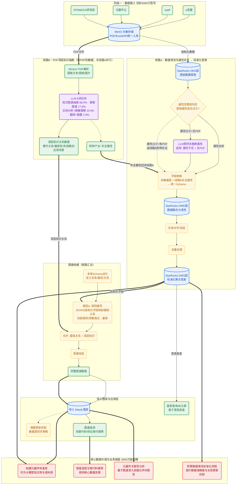

```mermaid
flowchart TD
    classDef done fill:#e6f4ea,stroke:#1e8e3e,stroke-width:2px,color:#137333;
    classDef todo fill:#fef7e0,stroke:#f9ab00,stroke-width:2px,stroke-dasharray: 5 5,color:#b06000;
    classDef db fill:#e8f0fe,stroke:#1a73e8,stroke-width:2px,color:#174ea6;
    classDef value fill:#fce8e6,stroke:#ea4335,stroke-width:2px,color:#a50e0e;
    classDef llm fill:#f3e8fd,stroke:#9334e6,stroke-width:2px,color:#7627bb;

    subgraph 阶段一 [阶段一：数据接入 目标3000万型号]
        direction TB
        S1(e洛盟):::done
        S2(icpdf):::done
        S3(元器件云):::done
        S4(DFM&EDA研发部):::done
        MinIO[(MinIO 对象存储\nPDF/Excel/API统一入库)]:::db
        S1 & S2 & S3 & S4 --> MinIO
    end

    subgraph 线路A [线路A：数据清洗与属性补全 → 标准化宽表]
        direction TB
        ODS[(StarRocks ODS层\n原始数据提取)]:::db
        AttrCheck{属性完整度判定\n提取属性是否过少?}:::todo
        LLM_Zero(LLM零样本推断属性\n适用: 属性不足 + 无PDF):::llm
        Mapping(字段映射\n多数据源 + 线路B补全属性\n→ 统一Schema):::todo
        DWD[(StarRocks DWD层\n数据融合与清洗)]:::db
        Align(实体对齐/消歧):::todo
        Dedup(去重处理):::todo
        DWS[(StarRocks DWS层\n标准化聚合宽表)]:::db

        ODS --> AttrCheck
        AttrCheck -- 属性达标 --> Mapping
        AttrCheck -- 属性过少+无PDF --> LLM_Zero --> Mapping
        AttrCheck -. 属性过少+有PDF\n由线路B附带补全 .-> Mapping
        Mapping --> DWD --> Align --> Dedup --> DWS
    end

    subgraph 线路B [线路B：PDF深层知识抽取（有PDF的数据，与线路A并行）]
        direction TB
        MinerU(MinerU PDF解析\n提取文本/表格/图片):::done
        LLM6(LLM 6项任务\n知识图谱抽取 68.4% · 事理图谱 17.8%\n文档分析+图像理解 10.9% · 翻译+摘要 2.9%):::llm
        DeepKG(深层知识关系数据\n替代关系/兼容性/失效模式/应用场景):::done
        AttrOut(附带产出: 补全属性):::done

        MinerU --> LLM6
        LLM6 --> DeepKG
        LLM6 -.-> AttrOut
    end

    subgraph 阶段三 [图谱构建（两路汇合）]
        direction TB
        Schema(本体Schema设计\n定义实体/属性/关系):::todo
        RuleRel(路径A: 规则推导\n从DWS结构化字段映射基础关系\n封装相同/参数相近→兼容):::todo
        MergeGraph(合并: 基础关系 + 深层知识):::todo
        QC(质量校验):::todo
        GraphData(完整图谱数据):::done

        Schema --> RuleRel --> MergeGraph --> QC --> GraphData
    end

    subgraph 阶段四 [导入图库与应用层]
        direction TB
        Neo4j[(导入 Neo4j 图库)]:::db
        Sync(增量更新机制\n数据源同步策略):::todo
        AppGraph(图谱查询\n找替代料/供应商代理等):::done
        AppBI(报表查询/BI大屏\n基于宽表直查):::done

        GraphData --> Neo4j
        Neo4j -.-> Sync
        Neo4j --> AppGraph
    end

    subgraph 阶段五 [核心数据价值与业务赋能 3000万级规模]
        direction TB
        V1(构建元器件标准库\n作为大模型知识库与语料库):::value
        V2(智能选型与替代料推荐\n提供核心数据支撑):::value
        V3(元器件关联性分析\n基于图谱深入挖掘元件间联系):::value
        V4(积累数据清洗标准化流程\n提升数据准确度与长效更新机制):::value
    end

    %% 跨线路/阶段主线连接
    MinIO -->|结构化数据| ODS
    MinIO ==>|PDF文件| MinerU
    AttrOut ==>|补全属性回流线路A| Mapping
    DWS ==>|结构化字段| RuleRel
    DeepKG ==>|深层知识关系| MergeGraph
    GraphData ===> Neo4j
    DWS -->|宽表直查| AppBI

    %% 业务价值赋能连线
    Neo4j ===> V3
    Neo4j ===> V1
    AppGraph ===> V2
    DWS ===> V1
    DWS ===> V4
```
